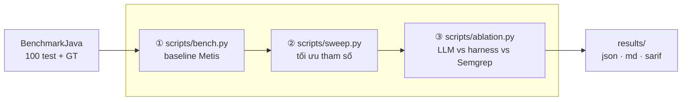

# Scan BenchmarkJava bằng Metis

## Tổng quan

- Cải thiện so với báo cáo trước:
  - Viết lại ngắn gọn, dễ đọc hơn
  - Dùng một dataset có **ground truth** rõ ràng để đánh giá chính xác precision và recall
  - Thêm ablation study để bóc tách Metis
  - Giữ sweep để tìm variant tham số tốt hơn

## Dataset

- Repo đích: [BenchmarkJava](https://github.com/OWASP-Benchmark/BenchmarkJava) — thuộc OWASP, **có ground truth** sẵn.
- 2740 test case riêng lẻ. Mỗi test case là một đoạn code; ground truth ghi nhận có lỗ hổng hay an toàn (các case an toàn dùng để **bẫy false positive**).
- Phạm vi kiểm thử: **100 test case đầu** — gồm **75 case có lỗ hổng** và **25 case an toàn**.

## Cách thực hiện

- Viết script Python chạy scan bằng một lệnh, trả về thời gian, token, precision, recall, … → ghi ra JSON / markdown.
- Chạy tuần tự như sau:

| Lần | Script               | Mục đích                                | Lệnh chạy                               |
| --- | -------------------- | --------------------------------------- | --------------------------------------- |
| 1   | `scripts/bench.py`   | Đo baseline Metis (`review_file` × 100) | `./scripts/bench.py --sample 100 -y`    |
| 2   | `scripts/sweep.py`   | Tìm variant tham số tốt hơn             | `./scripts/sweep.py --sample 100 -y`    |
| 3   | `scripts/ablation.py`| So discovery: LLM vs harness vs Semgrep | `./scripts/ablation.py --sample 100 -y` |

> **strict vs lenient** — khác ở nhãn triage `inconclusive` của Metis: **strict** vẫn tính là báo cáo (dev phải đọc), **lenient** coi như đã loại. `valid` = báo · `invalid` = loại. Không triage → mọi finding mặc định `valid` → hai cột trùng nhau. Chênh lệch hai cột = mức do dự của model.

### Lần 1 — Metis baseline

- Model: `deepseek-v4-flash`, cấu hình mặc định của Metis.

| Chỉ số            | strict           | lenient          |
| ----------------- | ---------------- | ---------------- |
| TP / FP / FN / TN | 50 / 4 / 25 / 21 | 47 / 4 / 28 / 21 |
| Precision         | **92.6%**        | 92.2%            |
| Recall            | **66.7%**        | 62.7%            |

Chi phí: **97 finding · 150.6 phút · 2.74M token** (2.36M in / 0.39M out).

**Theo category**

| Category     | Test | Recall    | Precision |
| ------------ | ---- | --------- | --------- |
| weakrand     | 18   | **30.8%** | 66.7%     |
| sqli         | 15   | 92.9%     | 92.9%     |
| hash         | 13   | **14.3%** | 100%      |
| crypto       | 12   | 100%      | 100%      |
| pathtraver   | 12   | 100%      | 100%      |
| cmdi         | 10   | **42.9%** | 75.0%     |
| xss          | 8    | 87.5%     | 100%      |
| trustbound   | 5    | **0%**    | —         |
| securecookie | 4    | **0%**    | —         |
| ldapi        | 3    | 100%      | 100%      |

→ Điểm yếu recall: `hash` (14.3%), `trustbound` / `securecookie` (0%), `weakrand` (30.8%), `cmdi` (42.9%).

---

### Lần 2 — Sweep tham số

Mô tả: `./scripts/sweep.py --sample 100`, 5 variant, mỗi variant gọi `review_code` một lần trên cả tập test.

| Variant      | Thay đổi                              | Phút     | Token     | Findings | GT-P  | GT-R      |
| ------------ | ------------------------------------- | -------- | --------- | -------- | ----- | --------- |
| `baseline`   | (không đổi)                           | 29.4     | 3.18M     | 94       | 100%  | 66.7%     |
| `workers_10` | `max_workers` 5→10                    | 18.0     | **0.27M** | 48       | 92.9% | **34.7%** |
| `rounds_3`   | `model_tools.max_rounds` 6→3          | 19.9     | 3.83M     | 128      | 95.3% | **81.3%** |
| `reach_1`    | `reachability_max_paths_per_sink` 3→1 | 20.7     | 4.15M     | 130      | 95.2% | 80.0%     |
| `lean_combo` | gộp cả 3                              | **12.8** | 4.04M     | 127      | 96.8% | **81.3%** |

→ `rounds_3` và `lean_combo` nâng recall baseline 66.7% → **81.3%** (precision vẫn ≥95%). `lean_combo` nhanh nhất (12.8 phút). `workers_10` một mình bất thường (0.27M token · 48 finding · recall 34.7%) — nghi chạy lỗi/cắt sớm; khi gộp trong `lean_combo` thì không tái hiện.

---

### Lần 3 — Ablation study

Mục tiêu: hiệu suất đến từ LLM reasoning trong agent loop, hay từ tri thức miền hard-code trong static analysis (ruleset)?

Mô tả: `./scripts/ablation.py --sample 100` — cùng model, cùng ground truth, cùng `BASE_ENGINE`, **chỉ khác cơ chế discovery**:

| Arm             | Cơ chế                              | Cấu hình                                     |
| --------------- | ----------------------------------- | -------------------------------------------- |
| A `prompt_only` | LLM trần, không tool, không triage  | `--tools none`, `review_code`                |
| B `harness`     | Agent loop + tool đọc file + triage | `--tools navigation --triage`, `review_code` |
| C `static`      | **Semgrep tìm, LLM chỉ verify**     | `metis --command "triage <sarif>"`           |
| `B_union_C`     | Gộp offline SARIF của B và C        | dẫn xuất, **0 token thêm**                   |

#### Kết quả

| Arm           | Youden strict | Youden **lenient** | Precision | Recall    | FPR      | Token     | Phút    | Youden/1M |
| ------------- | ------------- | ------------------ | --------- | --------- | -------- | --------- | ------- | --------- |
| `prompt_only` | 54.7%         | 54.7%              | 93.0%     | 70.7%     | 16.0%    | **0.56M** | 16.2    | **98.1**  |
| `harness`     | **70.7%**     | 46.7%              | 94.2%     | **86.7%** | 16.0%    | 3.44M     | 38.4    | 20.6      |
| `static`      | 61.3%         | **64.0%**          | **96.3%** | 69.3%     | **8.0%** | 2.08M     | **8.1** | 29.5      |
| `B_union_C`   | 69.3%         | **68.0%**          | 92.1%     | **93.3%** | 24.0%    | 5.51M     | 46.4    | 12.6      |

> Precision / Recall / FPR lấy từ cột **strict**. Token và phút của `B_union_C` là **tổng** của B + C (arm dẫn xuất, không gọi LLM thêm). Cả ba arm nguồn đều trên Pareto front; ROI cao nhất: `prompt_only`.

Chi tiết counts (strict): A `TP 53 / FP 4 / FN 22 / TN 21` · B `TP 65 / FP 4 / FN 10 / TN 21` · C `TP 52 / FP 2 / FN 23 / TN 23` · union `TP 70 / FP 6 / FN 5 / TN 19`.

#### Recall theo category

| Category     | n   | `prompt_only` | `harness` | `static` |
| ------------ | --- | ------------- | --------- | -------- |
| weakrand     | 18  | 62%           | **92%**   | **0%**   |
| sqli         | 15  | 86%           | 100%      | 86%      |
| hash         | 13  | **29%**       | **29%**   | 57%      |
| crypto       | 12  | 44%           | 89%       | 100%     |
| pathtraver   | 12  | 100%          | 100%      | 80%      |
| cmdi         | 10  | 86%           | 100%      | 100%     |
| xss          | 8   | 75%           | 88%       | 88%      |
| trustbound   | 5   | 67%           | **33%**   | 67%      |
| securecookie | 4   | **0%**        | 100%      | **0%**   |
| ldapi        | 3   | 100%          | 100%      | 100%     |

## Kết luận

1. **Ba cơ chế phân tầng rõ.** `harness` thắng recall (86.7%). `static` thắng precision / FPR (96.3% / 8%). `prompt_only` thắng ROI token (98.1 Youden/1M).
2. `static` **yếu vì ruleset**, không phải kiến trúc — mất trắng `weakrand` (0/13 vuln) và `securecookie` (0/1). Bổ rule hai nhóm này là cách nâng recall static rẻ nhất.
3. `static` **rẻ hơn harness**: 2.08M vs 3.44M token, wall-clock **~4.7×** (8.1 vs 38.4 phút). Toàn bộ token của C là khâu triage.
4. **Harness phát hiện thêm** so với `prompt_only` (+16 điểm recall: 70.7% → 86.7%) với ~6.2× token. Giá trị agent loop lần này đo được; phía lenient thì harness tụt mạnh (Youden 70.7% → 46.7%) vì triage đánh nhiều finding thành `inconclusive`.
5. **Bổ sung có ích vừa phải.** Union trên 75 vuln: **47 chung · 18 chỉ harness · 5 chỉ Semgrep · 5 cả hai bỏ**. Thêm Semgrep vào harness được +5 TP nhưng FPR xấu hơn (16% → 24%).
6. **Union gần ngang harness ở strict** (Youden 69.3% vs 70.7%) và **thắng lenient** (68.0%). Đáng dùng nếu chấp nhận FPR cao hơn hoặc tin nhãn `inconclusive`.
7. **Pareto:** cả `prompt_only`, `harness`, `static` đều trên frontier. Muốn ROI → `prompt_only`; muốn điểm cao → `harness`; muốn nhanh + ít FP → `static`.

---

## Việc chưa làm

- [ ] **Thử nghiệm sửa prompt**: chưa làm. Hai hướng đáng thử nhất là (a) sửa **CWE mapping** / nhận diện `hash` (recall LLM chỉ 29%), và (b) prompt riêng cho `trustbound` / `weakrand` (baseline yếu).
- [ ] **Bổ rule Semgrep cho** `weakrand` **và** `securecookie` — arm C hiện mất trắng hai nhóm này. Đây là cách nâng recall của static rẻ nhất.
- [ ] **Mở rộng scope để tăng số mẫu âm.** 25 mẫu âm là quá ít — mỗi mẫu âm nặng 4 điểm FPR. Muốn FPR ổn định hơn thì cần ≥100 mẫu âm, tức khoảng ~400 test.
- [ ] **Kiểm lại** `workers_10` **trong sweep** — run đơn lẻ token/recall bất thường; cần tái chạy trước khi kết luận về `max_workers`.