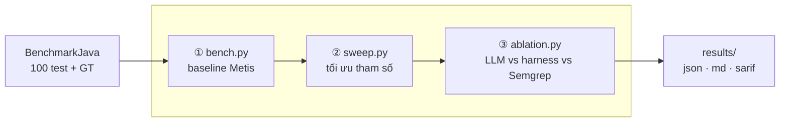

# Scan BenchmarkJava bằng Metis

## Tổng quan

- Cải thiện so với báo cáo trước:
  - Viết lại ngắn gọn, dễ đọc hơn
  - Dùng một dataset có **ground truth** rõ ràng để đánh giá chính xác precision và recall
  - Thêm ablation study để bóc tách Metis
  - Giữ sweep để tìm variant tham số tốt hơn

## Dataset

- Repo đích: [BenchmarkJava](https://github.com/OWASP-Benchmark/BenchmarkJava) — thuộc OWASP, **có ground truth** sẵn.
- 2740 test case riêng lẻ. Mỗi test case là một đoạn code; ground truth ghi nhận có lỗ hổng hay an toàn (các case an toàn dùng để **bẫy false positive**).
- Phạm vi kiểm thử: **100 test case đầu** — gồm **75 case có lỗ hổng** và **25 case an toàn**.

## Cách thực hiện

- Viết script Python chạy scan bằng một lệnh, trả về thời gian, token, precision, recall, … → ghi ra JSON / markdown.
- Chạy tuần tự như sau:

| Lần | Script        | Mục đích                                | Lệnh chạy                          |
| --- | ------------- | --------------------------------------- | ---------------------------------- |
| 1   | `bench.py`    | Đo baseline Metis (`review_file` × 100) | `./bench.py --sample 100 -y`       |
| 2   | `sweep.py`    | Tìm variant tham số tốt hơn             | `./sweep.py --sample 100 -y`       |
| 3   | `ablation.py` | So discovery: LLM vs harness vs Semgrep | `./ablation.py --sample 100 -y`    |

> **strict vs lenient** — khác ở nhãn triage `inconclusive` của Metis: **strict** vẫn tính là báo cáo (dev phải đọc), **lenient** coi như đã loại. `valid` = báo · `invalid` = loại. Không triage → mọi finding mặc định `valid` → hai cột trùng nhau. Chênh lệch hai cột = mức do dự của model.

### Lần 1 — Metis baseline

- Model: `deepseek-v4-flash`, cấu hình mặc định của Metis.

| Chỉ số            | strict          | lenient         |
| ----------------- | --------------- | --------------- |
| TP / FP / FN / TN | 71 / 8 / 4 / 17 | 71 / 8 / 4 / 17 |
| Precision         | **89.9%**       | 89.9%           |
| Recall            | **94.7%**       | 94.7%           |

Chi phí: **118 finding · 67.3 phút · 3.56M token** (3.38M in / 0.17M out).

**Theo category**

| Category     | Test | Recall    | Precision |
| ------------ | ---- | --------- | --------- |
| weakrand     | 18   | 100%      | 92.9%     |
| sqli         | 15   | 100%      | 93.3%     |
| hash         | 13   | **71.4%** | **71.4%** |
| crypto       | 12   | 100%      | 90.0%     |
| pathtraver   | 12   | 90.0%     | 90.0%     |
| cmdi         | 10   | 100%      | 87.5%     |
| xss          | 8    | 100%      | 100%      |
| trustbound   | 5    | **66.7%** | **66.7%** |
| securecookie | 4    | 100%      | 100%      |
| ldapi        | 3    | 100%      | 100%      |

→ `hash` và `trustbound` là hai điểm yếu về recall (71.4% và 66.7%).

---

### Lần 2 — Sweep tham số

Mô tả: `./sweep.py --sample 100`, 5 variant, mỗi variant gọi `review_code` một lần trên cả tập test.

| Variant      | Thay đổi                              | Phút    | Token     | Findings | GT-P  | GT-R  |
| ------------ | ------------------------------------- | ------- | --------- | -------- | ----- | ----- |
| `baseline`   | (không đổi)                           | 14.8    | 3.82M     | 125      | 91.1% | 96.0% |
| `workers_10` | `max_workers` 5→10                    | **8.1** | 3.79M     | 125      | 93.3% | 93.3% |
| `rounds_3`   | `model_tools.max_rounds` 6→3          | 14.0    | **3.43M** | 117      | 94.6% | 93.3% |
| `reach_1`    | `reachability_max_paths_per_sink` 3→1 | 14.5    | 3.98M     | 130      | 86.4% | 93.3% |
| `lean_combo` | gộp cả 3                              | **7.4** | 3.85M     | 124      | 90.0% | 96.0% |

→ Trên 100 test, precision/recall các variant gần như phẳng (sai số ~1 file = 1%). `rounds_3` tiết kiệm token rõ nhất (~−10%); tăng `max_workers` chủ yếu giảm wall-clock, không giảm token.

---

### Lần 3 — Ablation study

Mục tiêu: hiệu suất đến từ LLM reasoning trong agent loop, hay từ tri thức miền hard-code trong static analysis (ruleset)?

Mô tả: `./ablation.py --sample 100` — cùng model, cùng ground truth, cùng `BASE_ENGINE`, **chỉ khác cơ chế discovery**:

| Arm             | Cơ chế                              | Cấu hình                                     |
| --------------- | ----------------------------------- | -------------------------------------------- |
| A `prompt_only` | LLM trần, không tool, không triage  | `--tools none`, `review_code`                |
| B `harness`     | Agent loop + tool đọc file + triage | `--tools navigation --triage`, `review_code` |
| C `static`      | **Semgrep tìm, LLM chỉ verify**     | `metis --command "triage <sarif>"`           |
| `B_union_C`     | Gộp offline SARIF của B và C        | dẫn xuất, **0 token thêm**                   |

#### Kết quả

| Arm           | Youden strict | Youden **lenient** | Precision | Recall   | FPR       | Token     | Phút    | Youden/1M |
| ------------- | ------------- | ------------------ | --------- | -------- | --------- | --------- | ------- | --------- |
| `prompt_only` | 52.0%         | 52.0%              | 86.2%     | **100%** | 48.0%     | **0.55M** | **7.8** | **94.1**  |
| `harness`     | 52.0%         | 28.0%              | 86.2%     | **100%** | 48.0%     | 4.78M     | 109.6   | 10.9      |
| `static`      | 52.0%         | **58.7%**          | **92.7%** | 68.0%    | **16.0%** | 7.53M     | 15.9    | 6.9       |
| `B_union_C`   | 40.0%         | **66.7%**          | 83.3%     | **100%** | 60.0%     | 12.3M     | 125.6   | 3.2       |

> Precision / Recall / FPR lấy từ cột **strict**. Token và phút của `B_union_C` là **tổng** của B + C (arm dẫn xuất, không gọi LLM thêm).

Chi tiết counts (strict): A và B đều `TP 75 / FP 12 / FN 0 / TN 13` · C `TP 51 / FP 4 / FN 24 / TN 21` · union `TP 75 / FP 15 / FN 0 / TN 10`.

#### Recall theo category

| Category     | n   | `prompt_only` | `harness` | `static` |
| ------------ | --- | ------------- | --------- | -------- |
| weakrand     | 18  | 100%          | 100%      | **0%**   |
| sqli         | 15  | 100%          | 100%      | 86%      |
| hash         | 13  | 100%          | 100%      | 57%      |
| pathtraver   | 12  | 100%          | 100%      | 80%      |
| crypto       | 12  | 100%          | 100%      | 100%     |
| cmdi         | 10  | 100%          | 100%      | 100%     |
| xss          | 8   | 100%          | 100%      | 88%      |
| trustbound   | 5   | 100%          | 100%      | 33%      |
| securecookie | 4   | 100%          | 100%      | **0%**   |
| ldapi        | 3   | 100%          | 100%      | 100%     |

## Kết luận

1. **Hai cơ chế ngược nhau.** LLM: recall 100%, FPR 48%. Static: precision 92.7%, FPR 16%, recall 68%.
2. `static` **yếu vì ruleset**, không phải kiến trúc — mất trắng `weakrand` (0/18) và `securecookie` (0/4). Bổ rule hai nhóm này là cách nâng recall rẻ nhất.
3. `static` **không rẻ token** (7.53M vs 4.78M `harness`) vì triage ~100k token/finding; cái tiết kiệm là **wall-clock ~7×** (15.9 vs 109.6 phút).
4. **Harness không phát hiện thêm** — cột strict bằng `prompt_only` dù đắt ~8.7× token. Giá trị thật nằm ở **lenient**: triage đánh nhiều finding thành `inconclusive` và hạ FP 12→2; `prompt_only` gắn `valid` đều nên khó ưu tiên khi dev tự lọc.
5. **Bổ sung yếu.** Union: 54 chung · 74 chỉ harness · **6 chỉ Semgrep**. Thay harness bằng Semgrep mất nhiều recall; thêm Semgrep vào harness được ít mà FPR xấu hơn (48%→60%).
6. **Union thắng lenient (66.7%), thua strict (40%)** vì phép hợp cộng FP hai bên — chỉ đáng dùng nếu tin nhãn `inconclusive`.
7. **Youden strict = 52% cả ba arm là trùng hợp**, không phải bug: A↔B triệt tiêu 4–4 trên 8 test khác nhau; C là `68 − 16 = 52`.

---

## Việc chưa làm

- [ ] **Thử nghiệm sửa prompt**: chưa làm. Nhìn finding lần 1, hai hướng đáng thử nhất là (a) sửa **CWE mapping** để hết FN oan kiểu `CWE-759` vs `CWE-328`, và (b) prompt riêng cho `trustbound` (category yếu nhất).
- [ ] **Bổ rule Semgrep cho** `weakrand` **và** `securecookie` — arm C hiện mất trắng 22/100 test ở hai nhóm này. Đây là cách nâng recall của static rẻ nhất.
- [ ] **Mở rộng scope để tăng số mẫu âm.** 25 mẫu âm là quá ít — mỗi mẫu âm nặng 4 điểm FPR. Muốn FPR ổn định hơn thì cần ≥100 mẫu âm, tức khoảng ~400 test.
