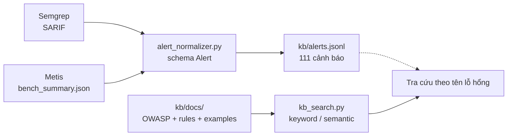
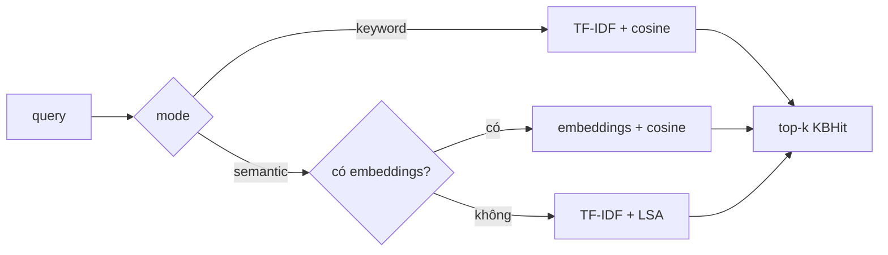

# Chuẩn hóa kết quả quét và xây kho tri thức

## Mục tiêu

Chuyển kết quả thô của công cụ quét (Semgrep, Metis) về **một cấu trúc chung**, gom vào một
tệp duy nhất, kèm một **kho tri thức nhỏ** và **chức năng tìm kiếm** để AI Agent tra cứu
theo tên lỗ hổng.

Sản phẩm được deploy tại: [https://scan-benchmarkjava-production.up.railway.app/](https://scan-benchmarkjava-production.up.railway.app/)

## Sơ đồ tổng quan




## 1. Chương trình chuẩn hóa — `alert_normalizer.py`

Chuẩn hoá kết quả quét của các tool và variant khác nhau thành 1 dạng json chung như bên dưới:

```json
{
  "tool": "metis",
  "severity": "high",
  "file_or_url": "src/main/java/org/owasp/benchmark/testcode/BenchmarkTest00001.java",
  "title": "Path traversal via attacker-controlled cookie value",
  "description": "The cookie value is taken from the request and used directly in constructing a file path...",
  "rule_id": null,
  "cwe": "CWE-22",
  "line": 57,
  "source_path": "results/baseline/bench_summary.json"
}
```


## 2. Tệp dữ liệu tổng hợp — `kb/alerts.jsonl`

Định dạng JSONL (mỗi dòng 1 JSON) để đọc theo dòng, nối thêm được, dễ đưa vào agent.


|                                          | Số lượng         |
| ---------------------------------------- | ---------------- |
| Tổng cảnh báo                            | **111**          |
| Từ Metis                                 | 97               |
| Từ Semgrep                               | 14               |
| Theo mức: medium / high / critical / low | 45 / 36 / 21 / 9 |


## 3. Kho tri thức nhỏ — `kb/docs/`

23 file markdown, mỗi file có frontmatter `id` / `title` / `category`:


| Nhóm           | Số file | Nội dung                                                                    |
| -------------- | ------- | --------------------------------------------------------------------------- |
| `owasp-top10/` | 10      | A01–A10 (2021): là gì, vì sao nguy hiểm, ví dụ ngắn                         |
| `rules/`       | 3       | Tài liệu công cụ quét: `semgrep-overview`, `weak-random`, `insecure-cookie` |
| `examples/`    | 10      | Ví dụ lỗ hổng web có thật                                                   |


10 ví dụ: SQL Injection, XSS, Command Injection, Path Traversal, LDAP Injection,
XPath Injection, Weak PRNG, Weak Hash, Insecure Cookie, Trust Boundary Violation.

Mỗi ví dụ theo cùng một khuôn: **CWE → giải thích → đoạn code lỗi (**`## Vulnerable`**) →
đoạn code đã sửa (**`## Fixed`**)**. Nhờ khuôn cố định này, hàm tìm kiếm bóc riêng được đoạn
code lỗi để hiển thị / trả cho agent.

## 4. Chức năng tìm kiếm — `kb_search.py`

Hai chế độ:




- **keyword**: TF-IDF trên toàn bộ `kb/docs/**/*.md`, xếp hạng bằng cosine similarity.
- **semantic**: gọi endpoint `/embeddings` (`text-embedding-3-small`), cache vector theo
sha256 nội dung file trong `kb/.embeddings_cache.json` — chạy lần 2 không tốn thêm HTTP call.
Endpoint của môi trường hiện tại trả 404, nên **tự động fallback sang TF-IDF + LSA**
(`TruncatedSVD`) và vẫn trả kết quả thay vì lỗi. Lỗi chỉ log một lần, không retry-storm.

Hàm này được nối vào trang **Knowledge Base** của app Streamlit: gõ từ khóa → chọn
keyword/semantic → kết quả gom nhóm theo `examples` / `owasp-top10` / `rules`, kèm sẵn
đoạn code lỗi và toàn văn tài liệu.

## Sản phẩm bàn giao


| Yêu cầu                             | Tệp                                                                    |
| ----------------------------------- | ---------------------------------------------------------------------- |
| Chương trình chuẩn hóa dữ liệu      | `alert_normalizer.py`                                                  |
| Tệp dữ liệu tổng hợp các cảnh báo   | `kb/alerts.jsonl` (111 dòng)                                           |
| Kho tri thức nhỏ                    | `kb/docs/` (23 file: 10 OWASP + 3 rules + 10 examples)                 |
| Chức năng tìm kiếm theo tên lỗ hổng | `kb_search.py` → `search_kb()`, và trang Knowledge Base trong `app.py` |


