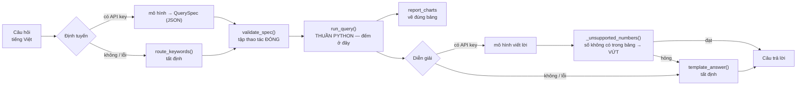

# Scan BenchmarkJava bằng Metis

**Live demo:** [https://scan-benchmarkjava-production.up.railway.app](https://scan-benchmarkjava-production.up.railway.app)
(bản public, read-only — sidebar có **Security Report** (trang mặc định) + **Comparison** +
**Knowledge Base**; trang Run Scan không được dựng ở đó, xem mục
[Deploy](#deploy-railway-chế-độ-read-only))

Chạy Metis trên [OWASP BenchmarkJava](https://github.com/OWASP-Benchmark/BenchmarkJava), đo thời gian / token và chấm precision–recall theo ground truth (`expectedresults-1.2.csv`). Không dùng LLM-judge.

Phạm vi mặc định: **100 test đầu** (`BenchmarkTest00001` …) — 75 TP / 25 FP.

## Hướng dẫn chạy dự án

### Yêu cầu


| Thành phần                         | Ghi chú                                                                                                                 |
| ---------------------------------- | ----------------------------------------------------------------------------------------------------------------------- |
| [`uv`](https://docs.astral.sh/uv/) | Bắt buộc — script và app chạy qua `uv run`                                                                              |
| `metis/`                           | Clone [arm/metis](https://github.com/arm/metis) ở thư mục gốc repo (không thuộc repo này)                               |
| `BenchmarkJava/`                   | Clone [OWASP BenchmarkJava](https://github.com/OWASP-Benchmark/BenchmarkJava) ở thư mục gốc repo (không thuộc repo này) |
| `semgrep`                          | Chỉ cần cho `scripts/ablation.py` (arm `static`)                                                                        |
| OpenCode API key                   | Model quét qua OpenAI-compatible endpoint                                                                               |


Đường dẫn workspace **không được có khoảng trắng** (Metis tách `--command` theo whitespace).

### Cài đặt & cấu hình

```bash
git clone https://github.com/anhtrinh2905/scan_benchmarkjava.git
cd scan_benchmarkjava
uv sync

cp .env.example .env
# Điền OPENCODE_API_KEY; chỉnh CUSTOM_SCAN_MODEL / OPENCODE_BASE_URL nếu cần
```


| Biến                | Ý nghĩa                                           |
| ------------------- | ------------------------------------------------- |
| `CUSTOM_SCAN_MODEL` | Model id dùng để quét (ví dụ `deepseek-v4-pro`)   |
| `OPENCODE_BASE_URL` | Base URL OpenAI-compatible (mặc định OpenCode Go) |
| `OPENCODE_API_KEY`  | API key                                           |


### Chạy giao diện Streamlit

```bash
uv run streamlit run src/app.py   # mở http://localhost:8501
```


### Chạy các script quét

```bash
./scripts/bench.py --sample 100 -y      # 1. Baseline
./scripts/sweep.py --sample 100 -y      # 2. Sweep tham số
./scripts/ablation.py --sample 100 -y   # 3. Ablation discovery
```

Chi tiết từng script — xem mục [Ba lần chạy chính](#ba-lần-chạy-chính) bên dưới.

## Cấu trúc thư mục

Chỉ liệt kê phần đã commit lên GitHub (`git ls-files`); `metis/` và `BenchmarkJava/` là clone ngoài, bị `.gitignore`.


| Thư mục / File               | Vai trò                                                                                                                                  |
| ---------------------------- | ---------------------------------------------------------------------------------------------------------------------------------------- |
| `src/app.py`                 | Ứng dụng Streamlit chính — điều khiển scan, xem Security Report/Comparison/Knowledge Base                                               |
| `src/scan_runner.py`         | Seam gọi Metis (chạy scan nền, đọc SARIF/summary) — `app.py` chỉ đọc qua đây, không tự parse file kết quả                               |
| `src/kb_search.py`           | Search Knowledge Base: keyword (TF-IDF/cosine) + semantic (embedding OPENCODE, fallback TF-IDF+LSA)                                     |
| `src/alert_normalizer.py`    | **Chuẩn hóa alert** — gộp SARIF (semgrep) và `bench_summary.json` (Metis) về một schema `Alert` phẳng, xem chi tiết [bên dưới](#chuẩn-hóa-alert-alert_normalizerpy) |
| `src/security_agent.py`      | **Agent phân tích bảo mật** — gộp nhóm cảnh báo, tra KB, gọi mô hình đúng 1 lần/nhóm, sinh báo cáo, xem [bên dưới](#agent-phân-tích-bảo-mật-security_agentpy) |
| `src/report_query.py`        | **Tầng truy vấn tất định** trên báo cáo đã sinh — tập thao tác đóng, thuần Python, 0 mạng, xem [bên dưới](#hỏi-đáp-và-biểu-đồ-report_querypy--report_chartspy--report_chatpy) |
| `src/report_charts.py`       | Dựng spec Altair từ kết quả truy vấn — chỉ vẽ đúng bảng số liệu được đưa, không tự tính lại                                              |
| `src/report_chat.py`         | **Hỏi đáp lai** — mô hình chọn truy vấn và viết lời, Python đếm số; mọi thất bại rơi về đường tất định có nhãn                            |
| `src/prompts/`               | System prompt có version, hash vào mọi báo cáo: `security_analyst.md` (agent phân tích) và `report_chat.md` (hỏi đáp)                    |
| `scripts/`                   | Công cụ dòng lệnh cho dev: `bench.py`, `sweep.py`, `ablation.py`, `analyze.py`, `bake_chat.py` — không phải app                          |
| `data/kb/`                   | Kho tri thức (Knowledge Base): docs OWASP Top 10, ví dụ lỗ hổng, rule Semgrep tham khảo                                                  |
| `data/rules/`                | Rule Semgrep tùy biến cho BenchmarkJava (dùng ở arm `static` của ablation)                                                               |
| `data/results/`              | Kết quả quét đã bake sẵn (`bench_summary.json`, `scorecard.md`, `compare.*`, `detail.json`) — phục vụ trang Comparison khi deploy read-only |
| `data/analysis/`             | Báo cáo phân tích đã sinh sẵn (`report.jsonl` + `report.meta.json`) + `chat_cache.json` (câu trả lời dựng sẵn) — phục vụ trang Security Report khi deploy read-only |
| `docs/specs/`                | Spec kỹ thuật (`spec-ablation-runner.md`)                                                                                                |
| `tests/`                     | Test đơn vị, mock toàn bộ mạng: `test_security_agent.py` (76 test) + `test_report_query.py` (76 test) + fixture                          |
| `tests/e2e/`                 | Kiểm thử tự động — smoke test Playwright trên bản deploy                                                                                 |
| `reports/`                   | Báo cáo tuần đã nộp (`2026-07-29_..._Week1.md`, …) — cố định, không sửa lại sau khi nộp                                                  |
| `.streamlit/`                | Config Streamlit (`config.toml`)                                                                                                         |
| `Dockerfile`, `railway.toml` | Build & deploy Railway                                                                                                                   |
| `pyproject.toml`, `uv.lock`  | Quản lý dependency bằng `uv`                                                                                                             |


### Chuẩn hóa alert (`alert_normalizer.py`)

`src/alert_normalizer.py` là module thư viện độc lập (không có `st.*`, không tự chạy) —
đưa kết quả từ 2 nguồn khác định dạng về **một schema `Alert` phẳng** để Knowledge Base
đọc chung, không phải viết riêng logic parse cho từng tool:

| Hàm | Input | Chuẩn hóa từ |
| --- | --- | --- |
| `normalize_sarif(sarif_path, tool)` | file SARIF (`.sarif`/`.json`) | Semgrep — đọc `runs[].results[]`, suy `severity` từ SARIF `level` (mặc định `medium` nếu rule không set), tách `CWE-\d+` từ message |
| `normalize_bench_summary(summary_path)` | `bench_summary.json` | Metis — đọc `findings{test_name: [...]}`, map thẳng `severity`/`cwe_raw`/`line` do Metis đã trả có cấu trúc |
| `append_alerts(alerts, out_path=...)` | `list[Alert]` | Ghi nối (append) JSONL — hàm **duy nhất có side effect**, mặc định ghi vào `data/kb/alerts.jsonl` |

Schema `Alert` (dataclass): `tool` (`semgrep`/`metis`), `severity` (`critical`/`high`/`medium`/`low`/`info`), `file_or_url`, `title`, `description`, `rule_id`, `cwe`, `line`, `source_path`.

Hiện tại chưa có script/CLI nào gọi module này — đây là seam chuẩn bị cho card Knowledge
Base sắp tới (đọc `data/kb/alerts.jsonl` để hiển thị alert đã chuẩn hóa cạnh doc OWASP).
Muốn chạy thử chuẩn hóa thủ công:

```bash
cd src   # alert_normalizer.py import flat (như scan_runner.py/kb_search.py), cần chạy từ src/
```

```python
from pathlib import Path
from alert_normalizer import normalize_sarif, normalize_bench_summary, append_alerts

# đường dẫn tính từ repo root (ROOT trong alert_normalizer.py = parent.parent của src/)
alerts = normalize_sarif(Path("../data/results/ablation/static/semgrep.normalized.sarif"), tool="semgrep")
alerts += normalize_bench_summary(Path("../data/results/baseline/bench_summary.json"))
append_alerts(alerts)   # ghi nối vào data/kb/alerts.jsonl
```

Cả hai file input ở ví dụ trên là kết quả cục bộ sau khi chạy `scripts/ablation.py`/`scripts/bench.py`
(`semgrep.normalized.sarif` không nằm trong danh sách tracked của `data/results/`, xem
`.gitignore`) — chạy script tương ứng trước nếu máy bạn chưa có file này.

### Agent phân tích bảo mật (`security_agent.py`)

Biến `data/kb/alerts.jsonl` thành một báo cáo người đọc được: gộp cảnh báo cùng loại thành
nhóm, tra kho tri thức, gọi mô hình **đúng một lần cho mỗi nhóm**, rồi ghi ra JSONL. Không
tool-calling, không đa lượt — chi phí biết trước được, và phần lớn logic kiểm thử được offline.

Mô hình chỉ viết phần diễn giải. **File, số dòng, rule_id và CWE luôn do code điền** — mô hình
thậm chí không được nhận đường dẫn trong prompt, và nếu nó tự bịa ra thì đoạn đó bị vứt. Mức
nghiêm trọng và độ tin cậy mà mô hình trả về chỉ là *đề xuất*: Python kẹp mức nghiêm trọng
trong ±1 bậc so với mức công cụ tự báo, và ép sàn độ tin cậy khi bằng chứng mỏng.

```bash
./scripts/analyze.py                       # 111 cảnh báo — TỐN PHÍ, sẽ hỏi xác nhận
./scripts/analyze.py --no-llm              # tất định, 0 gọi mạng, output lặp lại giống hệt
./scripts/analyze.py --limit 3 -y          # chỉ đưa 3 nhóm nặng nhất cho mô hình
./scripts/analyze.py --from-run bench/baseline --no-llm
```

| Cờ | Mặc định | Ý nghĩa |
| --- | --- | --- |
| `--input PATH` | `data/kb/alerts.jsonl` | File JSONL cảnh báo đã chuẩn hóa |
| `--from-run KIND/NAME` | — | Nạp thẳng từ thư mục run qua `alert_normalizer` (loại trừ với `--input`) |
| `--out DIR` | `data/analysis` | Nơi ghi `report.jsonl` + `report.meta.json` |
| `--limit N` | — | Chỉ đưa N nhóm nặng nhất cho mô hình; phần còn lại vẫn thành phát hiện fallback |
| `--top-k N` | `3` | Số tài liệu KB lấy cho mỗi nhóm |
| `--min-score F` | `0.05` | Ngưỡng tương đồng KB |
| `--no-llm` | tắt | Chạy tất định, 0 lần gọi mạng |
| `--model ID` | `CUSTOM_SCAN_MODEL` | Ghi đè mô hình phân tích |
| `-y` / `--yes` | tắt | Bỏ bước hỏi xác nhận chi phí |

**Ba mã thoát** — thất bại phải phân biệt được, kể cả với script chỉ đọc mã thoát:

| Mã | Trạng thái | Nghĩa |
| --- | --- | --- |
| `0` | `ok` / `empty` | Có phát hiện; hoặc đầu vào **rỗng** (không phải "không có lỗ hổng") |
| `2` | `invalid_input` | Đọc được dòng nào cũng hỏng — mỗi dòng được liệt kê kèm số dòng và lý do |
| `3` | `degraded` | Bật LLM nhưng **mọi** nhóm đều rơi về fallback |

**System prompt:** `src/prompts/security_analyst.md` — file nguồn có `version:`, được hash
SHA-256 vào mọi báo cáo và từng phát hiện, nên "output thay đổi" luôn có lời giải thích. Nằm
trong `src/` chứ không phải `docs/` vì `.dockerignore` loại `/docs/`. Thiếu file hoặc file rỗng
→ agent từ chối chạy, không có prompt mặc định ẩn.

**Báo cáo ghi ra:** `data/analysis/report.jsonl` (JSONL thuần, mỗi dòng một phát hiện, nên
`wc -l` = số phát hiện) + `data/analysis/report.meta.json` (mọi giá trị theo lần chạy —
timestamp, token, thời gian — nằm hết ở đây, nhờ vậy file phát hiện ổn định từng byte giữa hai
lần chạy `--no-llm`). Cả hai **được commit vào git**: bản deploy không giữ API key nên không
thể tự sinh báo cáo.

Xem kết quả tại trang **Security Report** của app — nó là trang mặc định, nên trên bản deploy
chính là URL gốc:
[https://scan-benchmarkjava-production.up.railway.app](https://scan-benchmarkjava-production.up.railway.app).

Chạy test của agent (offline, 0 lần gọi mạng, không cần API key):

```bash
uv run pytest tests/test_security_agent.py -q
```

### Hỏi đáp và biểu đồ (`report_query.py` / `report_charts.py` / `report_chat.py`)

Trang **Security Report** không còn là một danh sách tĩnh, và cũng là trang mặc định của app.
Nó có hai tab, theo đúng thứ tự đó: **Hỏi đáp** (chatbot + danh sách phát hiện) và
**Tổng quan** (KPI → ma trận `severity` × `confidence` → 6 biểu đồ).

**Danh sách phát hiện không còn là tab riêng.** Nó nằm ngay dưới khung chat, và mỗi câu trả
lời có thể thu hẹp nó về đúng những phát hiện mà câu trả lời đó dựa vào
(`QueryResult.finding_ids`) — hỏi "liệt kê các lỗi CWE-89" thì danh sách bên dưới còn đúng 12
phát hiện, kèm một nút "Xem tất cả" để bỏ thu hẹp. Câu trả lời và bằng chứng của nó nằm trên
cùng một mặt, không phải hai tab.

**Bảy câu hỏi gợi ý được trả lời sẵn** (`./scripts/bake_chat.py` → `data/analysis/chat_cache.json`)
nên bấm là hiện ngay, không đợi hai lần gọi mô hình. Chỉ **lời văn** được cache: truy vấn vẫn
chạy lại qua `report_query` mỗi lần mở trang, cache mang theo vân tay của báo cáo nó được bake
cùng, và mọi con số trong lời văn vẫn phải qua đúng cái cổng `_unsupported_numbers()` mà một
câu trả lời trực tiếp phải qua — lệch một con số là cache bị bỏ, rơi về đường thường. Mỗi câu
trả lời in kèm **mô hình nào viết, hết bao nhiêu token, mất bao lâu**; với câu dựng sẵn thì
token và thời gian là chi phí *lúc bake*, và dòng chú thích nói đúng như vậy.

Ma trận nằm ngay dưới KPI vì nó trả lời câu mà hai biểu đồ cột không trả lời được: *bao
nhiêu phát hiện vừa ở mức cao vừa có độ tin cậy thấp?* — `count_by severity` và
`count_by confidence` mỗi cái chỉ cho một trục, và không thể bắt chéo lại sau. Ô đó chính
là nhóm "trông khẩn cấp nhưng bằng chứng mỏng", thứ nên xem trước khi triage. Cả hai trục
đều do Python quyết định (severity bị kẹp ±1 bậc so với công cụ báo, confidence bị ép sàn
khi bằng chứng mỏng), và các ô cộng lại đúng bằng tổng số phát hiện — `app.py` chỉ tô màu,
`report_query.matrix()` mới là chỗ đếm.

Luật chia việc — mở rộng đúng nguyên tắc của agent phân tích sang hội thoại:



**Mô hình không bao giờ là người đếm.** Nó chỉ làm hai việc: chọn *truy vấn nào* để chạy, và
viết lời cho *kết quả đã tính sẵn*. Mọi con số đến từ `report_query` đọc `report.jsonl`. Điều
này được **cưỡng chế**, không phải chỉ dặn trong prompt: `_unsupported_numbers()` quét câu trả
lời của mô hình, thấy số nào bảng không giải thích được thì vứt cả đoạn và rơi về mẫu. Trong
một lần thử thật, mô hình viết "70" (= 27+24+19, một phép cộng nó không được phép làm) và bị
loại đúng như thiết kế.

**Bảng số liệu luôn hiện ngay dưới câu trả lời**, nên mọi câu chữ đều đối chiếu được tại chỗ.

| Thành phần | Đóng ở chỗ nào |
| --- | --- |
| Thao tác (`op`) | 6: `overview`, `count_by`, `top_files`, `list_findings`, `lookup`, `kb_coverage` |
| Chiều thống kê | 6: `severity`, `confidence`, `cwe`, `owasp`, `tool`, `analysis_source` |
| Khoá lọc | 8: 6 chiều trên + `file` + `text` |
| Biểu đồ dashboard | 6 panel cố định, khai báo ở `report_charts.DASHBOARD_PANELS` |

Không có `eval`, không tra thuộc tính bằng chuỗi, không cho qua khoá lạ — một định tuyến mà
mô hình bịa ra sẽ bị `validate_spec()` từ chối và nêu đúng lý do.

**Hai lần gọi mô hình cho mỗi câu hỏi, cả hai đều không bắt buộc và hỏng riêng lẻ được.**
Định tuyến hỏng → `route_keywords()`; diễn giải hỏng → `template_answer()`. Mỗi lượt ghi lại
nó đã đi đường nào (`route_source` / `answer_source`), hiện trong khung "Câu trả lời này được
tạo ra thế nào?" — một câu trả lời do mẫu dựng **không bao giờ** được nhận nhầm là do mô hình
viết.

**Không có API key** thì chatbot vẫn dùng được: nó chạy hoàn toàn tất định, có banner nói rõ,
và **biểu đồ với số liệu không đổi** — chúng chưa bao giờ do mô hình sinh ra.

Muốn có lời văn do mô hình viết ở bản local, app đọc `.env` bằng chính bộ đọc của
`scripts/bench.py` (không có bộ đọc `.env` thứ tư trong repo). Biến đã export vẫn thắng:

```bash
uv run streamlit run src/app.py                 # tự đọc .env
OPENCODE_BASE_URL=https://x.invalid uv run streamlit run src/app.py   # ép hỏng để thử fallback
```

Chạy test (offline, 0 lần gọi mạng, không cần API key):

```bash
uv run pytest tests/test_report_query.py -q     # 88 test
```

### Bật mô hình thật trên bản deploy — và hạn mức đi kèm

Bản deploy công khai **không đăng nhập** (ADR 19). Trước đây nó an toàn vì không giữ khoá:
chỗ tệ nhất một khách ẩn danh làm được là *đọc*. Đưa khoá thật vào đổi đúng một thứ — ô chat
trở thành đường để **người lạ tiêu tiền của bạn**. Vì vậy khoá và trần chi tiêu đi cùng nhau.

Khoá **không** nằm trong image. `.dockerignore` loại `.env` có chủ đích, và một secret nướng
vào layer image thì ai pull được image là đọc được. Cấu hình đi qua **biến môi trường của
Railway**, tiêm lúc chạy — `model_available()` đọc thẳng `os.environ` nên không cần sửa code,
và `seed_model_env()` chỉ đọc file `.env` ở chế độ local.

```bash
railway variables --set OPENCODE_API_KEY=...        # secret — tự đặt, đừng dán vào chat/PR
railway variables --set OPENCODE_BASE_URL=https://opencode.ai/zen/go/v1
railway variables --set CUSTOM_SCAN_MODEL=deepseek-v4-pro
```

Hai lớp trần, chặn hai thứ khác nhau:

| Biến | Mặc định | Chặn cái gì |
| --- | --- | --- |
| `CHAT_DAILY_TOKEN_BUDGET` | `150000` | **Hoá đơn.** Token mỗi ngày UTC cho cả process. Hết → `answer()` ngừng gọi mô hình, lùi về đường tất định. Đặt `0` để bỏ trần. Gõ sai → về mặc định, **không** thành vô hạn |
| `CHAT_MAX_QUESTIONS_PER_SESSION` | `25` | **Phần của một người.** Để người đầu tiên tìm ra trang không uống hết ngân sách trong một lượt ngồi |

Trần theo phiên **cố ý dễ vượt** (mở phiên mới là reset) — nó là nút chia phần, không phải
kiểm soát truy cập; ở đây không có kiểm soát truy cập, theo thiết kế. Thứ thật sự giữ ví là
trần token theo ngày. Sổ token nằm trong process và **reset khi container khởi động lại**,
nên một lần redeploy cấp lại một ngày mới — chỗ lỏng đã biết, ghi ra đây thay vì giấu: nó
chặn trường hợp chạy loạn, chứ không phải đồng hồ tính tiền chính xác tới từng cent.

Hết hạn mức **không phải lỗi**. Trang lùi về đúng đường tất định mà nó đã chạy trước khi có
khoá: định tuyến từ khoá + câu trả lời dựng từ mẫu, số liệu và biểu đồ y nguyên. Lượt đó được
gắn nhãn `budget_exhausted` trong khung "Câu trả lời này được tạo ra thế nào?", nên một câu
do mẫu dựng không bao giờ bị nhận nhầm là do mô hình viết.

Thêm khoá **không** mở lại scan. Scan bị chặn ở tầng `scan_runner` bằng `SCAN_UI_READONLY`,
trang Run Scan không được dựng trên deploy, và `metis/` + `BenchmarkJava/` còn không có trong
image. Đường duy nhất tiêu token trên bản deploy là ô chat này.

## Ba lần chạy chính


| Lần | Script                | Mục đích                                             | Lệnh                                    |
| --- | --------------------- | ---------------------------------------------------- | --------------------------------------- |
| 1   | `scripts/bench.py`    | Baseline Metis (`review_file` × N)                   | `./scripts/bench.py --sample 100 -y`    |
| 2   | `scripts/sweep.py`    | So variant tham số (`review_code` một lần / variant) | `./scripts/sweep.py --sample 100 -y`    |
| 3   | `scripts/ablation.py` | So discovery: prompt / harness / Semgrep             | `./scripts/ablation.py --sample 100 -y` |


`-y` bỏ bước hỏi xác nhận. Full run tốn token và thời gian.

### 1. Baseline — `scripts/bench.py`

```bash
./scripts/bench.py --sample 100 -y
./scripts/bench.py --tag baseline --repeat 3 -y   # đo ổn định run-to-run
./scripts/bench.py --rescore                      # chỉ chấm lại từ SARIF đã có
./scripts/bench.py --force                        # bỏ cache, chạy lại
```

Kết quả: `data/results/<tag>/` (mặc định `data/results/baseline/`) — `bench_summary.json`, scorecard markdown, SARIF từng test.

Cờ hay dùng: `--parallel`, `--only SUB`, `--no-triage`, `--max-workers`, `--max-rounds`.

### 2. Sweep — `scripts/sweep.py`

5 variant tuần tự: `baseline`, `workers_10`, `rounds_3`, `reach_1`, `lean_combo`.

```bash
./scripts/sweep.py --sample 100 -y
./scripts/sweep.py --only baseline rounds_3 -y
./scripts/sweep.py --rescore
./scripts/sweep.py --force
```

Kết quả: `data/results/sweep/<variant>/` + `data/results/sweep/compare.{md,csv,json}`.

### 3. Ablation — `scripts/ablation.py`


| Arm           | Cấu hình                                           |
| ------------- | -------------------------------------------------- |
| `prompt_only` | `--tools none`, không triage                       |
| `harness`     | `--tools navigation`, có triage (= baseline sweep) |
| `static`      | Semgrep → Metis `triage`                           |
| `B_union_C`   | Gộp offline SARIF harness ∪ static (0 token thêm)  |


```bash
./scripts/ablation.py --sample 100 -y
./scripts/ablation.py --only harness static -y
./scripts/ablation.py --rescore
./scripts/ablation.py --force
```

Kết quả: `data/results/ablation/<arm>/` + `data/results/ablation/compare.{md,csv,json}` (Pareto / Youden per 1M token).

## Ghi chú

- Lần chạy sau với cùng tham số sẽ dùng **cache** (`[cache]`) — thêm `--force` để chạy lại.
- `--rescore` chỉ đọc SARIF đã có, không gọi Metis/Semgrep.
- Báo cáo phân tích kết quả: xem `reports/`.


## Deploy (Railway, chế độ read-only)

Bản deploy dùng chung **công khai, không cần đăng nhập** — và **không chạy được scan**,
**không giữ** `OPENCODE_API_KEY`. Nó chỉ phục vụ Security Report + Comparison +
Knowledge Base từ dữ liệu đã bake sẵn trong image. Cái giữ an toàn là instance không làm được
gì, chứ không phải khó truy cập. Muốn quét thật thì chạy local như phần
[Hướng dẫn chạy dự án](#hướng-dẫn-chạy-dự-án) trên.

Ở chế độ read-only, **trang Run Scan không được dựng** — sidebar chỉ có ba trang trên. Đây
là chuyện trình bày, không phải lớp bảo vệ: thứ chặn scan vẫn là `scan_runner.runtime_mode()`
từ chối spawn (ADR 19), và `page_run_scan` vẫn giữ nguyên guard read-only của nó dù không
còn đường nào tới. Kèm theo đó, Streamlit phục vụ trang mặc định ở `/` và **bỏ qua**
`url_path` của nó (`navigation/page.py`: `return "" if self._default else self._url_path`),
nên đúng một trang không thể link tới bằng tên. Trang đó bây giờ là **Security Report**: `/`
chính là nó, còn `/security-report` **không còn phân giải** — link công bố đã chuyển về URL
gốc, ở README, ở báo cáo Week 3 và ở bài kiểm tra e2e. `/comparison` và `/knowledge-base` vẫn
phân giải bình thường.

Vì không có API key, bản deploy cũng **không thể tự sinh báo cáo phân tích** — nó chỉ hiển thị
`data/analysis/report.jsonl` đã được commit và nướng vào image, đúng như nó hiển thị kết quả
quét mà không tự quét được. Muốn báo cáo mới thì chạy `./scripts/analyze.py` ở local rồi commit
lại kết quả.

Đang chạy tại: [https://scan-benchmarkjava-production.up.railway.app](https://scan-benchmarkjava-production.up.railway.app)


| Biến môi trường    | Đặt ở đâu               | Ý nghĩa                                                                                                         |
| ------------------ | ----------------------- | --------------------------------------------------------------------------------------------------------------- |
| `SCAN_UI_READONLY` | Dockerfile đặt sẵn `=1` | `1`/`true`/`yes` → chặn scan ở tầng `scan_runner`, không chỉ ẩn nút. Giá trị khác (kể cả gõ sai) → chế độ local |
| `PORT`             | Railway tự đặt          | Cổng Streamlit lắng nghe                                                                                        |
| `OPENCODE_API_KEY` | Railway variables       | **Secret.** Có mặt (cùng `OPENCODE_BASE_URL` + `CUSTOM_SCAN_MODEL`) thì chatbot gọi mô hình thật. Vắng → chạy tất định |
| `OPENCODE_BASE_URL` | Railway variables      | Endpoint OpenAI-compatible                                                                                      |
| `CUSTOM_SCAN_MODEL` | Railway variables      | Tên model dùng cho chatbot                                                                                      |
| `CHAT_DAILY_TOKEN_BUDGET` | Railway variables | Trần token mỗi ngày UTC cho cả process (mặc định `150000`, `0` = bỏ trần)                                       |
| `CHAT_MAX_QUESTIONS_PER_SESSION` | Railway variables | Số câu hỏi gọi mô hình mỗi phiên (mặc định `25`)                                                     |


Các bước:

1. Push repo lên GitHub.
2. Railway → **New Project** → **Deploy from GitHub repo** → chọn repo này. `railway.toml`
  khai báo sẵn builder `dockerfile` và healthcheck `/_stcore/health`.
3. **Variables** → không cần thêm gì. Đặc biệt không thêm `OPENCODE_API_KEY`.
4. **Settings → Networking** → Generate Domain.

Chạy thử image y hệt bản deploy ở máy local:

```bash
docker build -t scan-benchmarkjava .
docker run --rm -p 8501:8501 scan-benchmarkjava

railway up --detach #Re-deploy
```

Bỏ `-e SCAN_UI_READONLY` về `0` nếu muốn container chạy đầy đủ — nhưng khi đó phải tự mount
`metis/` + `BenchmarkJava/` và cấp API key, vì image không chứa chúng.

## Hạn chế đã biết

Rủi ro/nợ kỹ thuật đã cân nhắc và chấp nhận có chủ đích, không phải bị bỏ sót:

- **Bản deploy công khai, không có access control.** Cổng mật khẩu đã bị gỡ khỏi code
(không chỉ tắt) sau khi cân nhắc: nội dung public chỉ là scorecard (model, thời gian,
token, precision/recall) và tài liệu OWASP công khai — không có chuỗi dạng
credential. Cái giữ an toàn là instance không chạy được scan và không giữ
`OPENCODE_API_KEY`, không phải việc khó truy cập. Muốn khoá lại phải thêm code lại từ
đầu, vì cơ chế đã bị xoá chứ không phải tắt.
- **Một lần quét lỗi ngay từ đầu (model từ chối request) trông y hệt một lần quét sạch
trong mọi kết quả hiển thị — đã vá ở agent phân tích, VẪN CHƯA vá ở ba script quét.**
Từng xảy ra khi model quét trả lỗi 403 và Metis vẫn thoát mã 0 với `reviews: []`, khiến
`sweep.py` ghi nhận nhầm 3 variant là "chạy hợp lệ, 0% recall". Chỉ phát hiện được bằng
cách so token count thủ công giữa các run.
  - **Đã vá — chỉ trong `src/security_agent.py`:** một phản hồi `2xx` khai
    `usage.total_tokens == 0` bị coi là **thất bại** (`zero_tokens`), nhóm đó rơi về
    fallback có nhãn, và nếu mọi nhóm đều rơi thì cả lần chạy thành `degraded` + thoát mã
    `3`. Kiểm chứng bằng một HTTP server thật trả 200 với thân JSON hợp lệ nhưng 0 token.
  - **Chưa vá — `scripts/bench.py`, `scripts/sweep.py`, `scripts/ablation.py`:** ba script
    này *vẫn* không tự cảnh báo khi `usage.total_tokens == 0` mà `len(per_test) > 0`. Sự cố
    gốc xảy ra ở chính chúng, và chúng vẫn có thể ghi nhận một lần quét 0 token là hợp lệ.
    Vá một chỗ không phải vá cả nhà.
- **Truy hồi kho tri thức chỉ là TF-IDF từ khoá, và KB mới có 23 tài liệu.** 74/93 phát hiện
(79.6%) trích dẫn được tài liệu KB. 19 phát hiện còn lại đều *đã* được truy hồi 3 tài liệu
nhưng mô hình không trích dẫn cái nào — đúng, vì đó là kết quả trùng từ vựng chứ không đúng
chủ đề (ví dụ `insecure-cookie` trả về cho `CWE-15`). Con số này đo **độ phủ của KB**, không
đo chất lượng agent. Xem `DEBT.md`.
- **Bộ chặn bịa số của chatbot cố tình chặt tay, nên nó loại cả phép cộng đúng.**
`_unsupported_numbers()` chỉ chấp nhận con số có mặt trong bảng (cộng thêm phần trăm suy ra
được và số nhỏ ≤10). Một câu như "ba nhóm đầu chiếm 70 phát hiện" là **đúng số học** nhưng
vẫn bị loại, vì cho phép mọi tổng con thì bảo đảm "mô hình không đếm" không còn kiểm tra
được. Đây là đánh đổi có chủ đích: mất một phần chất lượng lời văn để đổi lấy một bảo đảm
máy kiểm tra được. Khi bị loại, người đọc vẫn nhận được câu trả lời tất định và thấy lý do.
- **Chatbot không có trí nhớ hội thoại.** Mỗi câu hỏi được định tuyến độc lập; "còn cái kia
thì sao?" sẽ không hiểu được. Đây là giới hạn phạm vi, không phải lỗi — nó giữ cho chi phí
mỗi lượt biết trước được (đúng 2 lần gọi) và giữ cho mọi lượt tái lập được.
- **Chất lượng lời giải thích chưa được đo.** Không có tập đánh giá, không có người chấm.
Những gì đã kiểm chứng là các thuộc tính máy kiểm tra được (0 đường dẫn bịa, 0 mã KB không
tồn tại, 93/93 dòng đúng lược đồ, output `--no-llm` giống hệt từng byte) — còn "dễ hiểu" thì
hiện là một tuyên bố, không phải một phép đo.
- **Thanh tiến trình (progress bar) đứng yên khi quét ít hơn 3 file** vì một dòng `print`
ở `bench.py` thiếu `flush=True`, nên log không tới nơi cho tới khi tiến trình kết thúc.
Cách sửa chỉ là thêm một keyword argument, nhưng chưa áp dụng vì nằm ngoài phạm vi các
card đã khoá file `scripts/*.py`.

