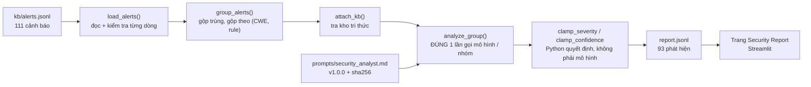

# Agent phân tích bảo mật — gộp nhóm cảnh báo, giải thích và đề xuất khắc phục

## Mục tiêu

1. Biến **111 cảnh báo thô** trong `data/kb/alerts.jsonl` thành một **báo cáo người đọc
   được**: gộp các cảnh báo cùng loại thành nhóm, giải thích bằng tiếng Việt, kèm cách kiểm
   tra và cách khắc phục, có trích dẫn tài liệu từ kho tri thức. *(phần 1–4)*
2. Đóng gói thành công cụ dòng lệnh `scripts/analyze.py` với **hành vi thất bại trung thực** —
   ba kịch bản hỏng phải phân biệt được bằng thông báo và bằng mã thoát, không được im lặng.
   *(phần 5)*
3. Đưa báo cáo lên **trang web công khai** để người không ngồi ở máy này cũng đọc được.
   *(phần 6)*

Trang Security Report:
[https://scan-benchmarkjava-production.up.railway.app/security-report](https://scan-benchmarkjava-production.up.railway.app/security-report)

## Sơ đồ tổng quan



Đây là **pipeline có biên**, không phải agent tự vòng lặp: không tool-calling, không đa lượt,
không tự đọc file. Nhờ vậy chi phí biết trước được (93 nhóm → 93 lần gọi) và phần lớn logic
kiểm thử được offline — 76 test chạy không tốn một đồng nào.

## 1. Agent là gì, và phần nào KHÔNG phải mô hình

`src/security_agent.py` (1263 dòng) là module thư viện, không có `st.*`, không có `argparse`,
không có `sys.exit`. Mô hình chỉ được gọi ở đúng **một** chỗ trong toàn bộ pipeline.

| Bước | Ai quyết định | Ghi chú |
| --- | --- | --- |
| Đọc & kiểm tra từng dòng | Python | Dòng hỏng bị bỏ qua kèm số dòng + lý do, phần còn lại vẫn chạy |
| Gộp trùng chính xác | Python | Cùng tool + file + dòng + rule_id |
| Gộp nhóm theo `(CWE, rule_family)` | Python | Tất định, nên `finding_id` ổn định giữa các lần chạy |
| Tra kho tri thức | Python (TF-IDF) | Trả tối đa 3 tài liệu / nhóm |
| Giải thích, cách kiểm tra, cách khắc phục | **Mô hình** | Một lần gọi cho mỗi nhóm |
| Mức nghiêm trọng cuối cùng | Python | Mô hình chỉ *đề xuất*, xem phần 7 |
| Độ tin cậy cuối cùng | Python | Mô hình chỉ *đề xuất*, có sàn cứng |
| File, số dòng, rule_id, CWE | Python | **Không bao giờ lấy từ mô hình** |

Dòng cuối là quan trọng nhất. Mô hình thậm chí không được *nhận* đường dẫn file hay số dòng
trong prompt — không đưa cho nó là cách rẻ nhất để nó không thể trả lại như thể tự tìm ra. Nếu
nó vẫn tự bịa ra một đường dẫn, đoạn đó bị vứt bỏ. Kiểm chứng trên toàn bộ 93 phát hiện:
**0 đường dẫn bịa, 0 cặp (file, dòng) không có trong dữ liệu vào, 0 mã tài liệu KB không tồn
tại.**

## 2. System Prompt — `src/prompts/security_analyst.md`

Prompt là **file nguồn có version**, không phải chuỗi nhúng trong code:

```
version: 1.0.0
sha256: 8b8356c3ff1b11cb6816b4c630bc2555c133ed568841cdd52fc23b4c0561a1b9
```

- Nằm trong `src/` chứ không phải `docs/` **có chủ đích**: `.dockerignore` loại `/docs/`, nên
  một prompt đặt ở đó sẽ không có mặt trong image đã deploy.
- `sha256` được ghi vào **mọi báo cáo** và vào **từng phát hiện**. Nghĩa là "kết quả thay đổi"
  luôn có lời giải thích: hoặc prompt đổi (hash đổi), hoặc không.
- Không có prompt mặc định ẩn. File thiếu hoặc rỗng → `PromptMissingError`, agent từ chối chạy
  chứ không âm thầm dùng một prompt nội bộ nào đó.

Prompt yêu cầu: viết tiếng Việt dễ hiểu (khoá và enum trong JSON vẫn là tiếng Anh); chỉ dùng
tài liệu KB và thông điệp công cụ được cung cấp; **không bịa** đường dẫn/số dòng/rule/CWE;
severity và confidence chỉ là *đề xuất* kèm lý do; trả về đúng một đối tượng JSON.

## 3. Từ 111 cảnh báo đến 93 phát hiện

Phép cộng bảo toàn được in ra mỗi lần chạy, dưới dạng biểu thức đã tính:

```
Bảo toàn: 109 + 2 + 0 == 111 -> True (meta.accounted_for=True)
```

Đọc là: **109** lần xuất hiện còn lại trong các nhóm **+ 2** bản trùng chính xác đã gộp
**+ 0** dòng hỏng bị bỏ qua **= 111** dòng đã đọc. Không có gì rơi mất mà số học không lên
tiếng — đây là cách chứng minh việc gộp nhóm không làm mất dữ liệu, thay vì chỉ nói suông.

| | Số lượng |
| --- | --- |
| Dòng đọc vào | **111** |
| Hợp lệ | 111 |
| Bỏ qua (hỏng) | 0 |
| Trùng chính xác, đã gộp | 2 |
| Nhóm | **93** |
| Phát hiện ghi ra | **93** |
| CWE khác nhau | 25 |

Nhóm lớn nhất gộp 10 cảnh báo — `CWE-330`, dùng `java.util.Random` làm nguồn ngẫu nhiên cho
mục đích bảo mật. Đó chính là giá trị của việc gộp: 10 dòng cảnh báo rời rạc trở thành **một**
việc cần sửa, kèm danh sách 10 vị trí.

Tỉ lệ gộp thực tế khiêm tốn (111 → 93). Lý do: khoá nhóm là `(CWE, rule_family)`, mà Metis
sinh `rule_id` mô tả rất chi tiết theo từng ca, nên hai cảnh báo cùng CWE thường vẫn khác
`rule_family`. Nói thẳng: việc gộp hiệu quả rõ rệt ở lớp lỗi lặp nhiều (weak PRNG, DES), còn
với phần đuôi dài thì gần như một-đổi-một.

## 4. Mức nghiêm trọng, độ tin cậy, và nguồn phân tích

Phân bố mức nghiêm trọng của **phát hiện** (khác với phân bố của *cảnh báo* ở báo cáo tuần 2,
vì một nhóm gộp nhiều cảnh báo):

| | critical | high | medium | low | info |
| --- | --- | --- | --- | --- | --- |
| Phát hiện | **22** | **38** | **26** | **7** | 0 |

Độ tin cậy và nguồn phân tích:

| | Số lượng | |
| --- | --- | --- |
| Mô hình phân tích (`llm`) | **90** / 93 | |
| Dự phòng (`fallback`) | **3** / 93 | cả 3 do `transport_error` |
| Tin cậy `high` | 3 | |
| Tin cậy `medium` | 74 | |
| Tin cậy `low` | 16 | gồm 3 phát hiện fallback |
| Có trích dẫn tài liệu KB | 74 / 93 (79.6%) | |
| Có đoạn code gợi ý sửa | 87 / 93 | |

Ba phát hiện `fallback` **không** trộn lẫn vào 90 phát hiện kia: chúng được gắn nhãn rõ trên
trang web ("Không có phân tích từ mô hình cho nhóm này"), độ tin cậy bị ép xuống `low`, và
phần giải thích tự nói ra rằng nó được ghép tự động từ tài liệu KB cộng thông điệp của công cụ.

**Về việc kẹp mức nghiêm trọng:** mô hình đã dịch chuyển mức ở **15/90** phát hiện, tất cả đều
đúng 1 bậc (ví dụ `high → critical` cho một khoá `remember-me` sinh bằng `java.util.Random`;
`medium → high` cho MD5 dùng lưu mật khẩu). Cả 15 đều nằm trong biên cho phép, nên **`severity_clamped`
là `false` ở cả 93 phát hiện** — nói cách khác, cơ chế kẹp lần này *không phải* can thiệp lần
nào. Đó là dữ kiện, không phải bằng chứng rằng cơ chế thừa: nó chỉ chứng minh mô hình đã cư xử
trong biên ở tập dữ liệu này. Việc kẹp hoạt động đúng được chứng minh riêng bằng bảng chân trị
25 cặp enum trong test.

## 5. Chi phí thật

| | Giá trị |
| --- | --- |
| Mô hình | `deepseek-v4-pro` |
| Lần gọi | **95** (93 nhóm + 2 lần thử lại do JSON sai lược đồ) |
| Token | **482,344** (~5,077 / lần gọi) |
| Thời gian | **3,530 giây ≈ 58.8 phút** (~38 giây / nhóm) |
| Thất bại | 3 (`transport_error`) |

`llm_calls` (95) lớn hơn số nhóm (93) đúng bằng số lần thử lại — mỗi phản hồi sai lược đồ được
gọi lại **một** lần duy nhất kèm mô tả lỗi cụ thể, rồi mới rơi về fallback. Ngân sách thử lại
là 1, không phải vòng lặp.

Toàn bộ 76 test đơn vị mock hoàn toàn phần mạng: chạy `uv run pytest` với mọi biến môi trường
bị gỡ vẫn xanh trong 2.16 giây và **0 lần gọi thật**.

## 6. Trang Security Report

Trang mới trong app Streamlit, đọc dữ liệu **chỉ** qua `security_agent.load_report()` —
`app.py` không mở file nào dưới `data/analysis/`, không tự parse JSONL, không gọi endpoint.

- Hàng KPI: 93 phát hiện · `111 → 93` · 3 phát hiện không có phân tích mô hình · số lượng theo
  từng mức nghiêm trọng.
- Bộ lọc: mức nghiêm trọng, độ tin cậy, và tìm theo tiêu đề / CWE / tên file. Số hiển thị luôn
  nói rõ *đang hiện bao nhiêu trên tổng bao nhiêu*.
- Mỗi phát hiện là một expander, thứ tự cố định: Vị trí → Bằng chứng từ công cụ quét (nguyên
  văn) → Giải thích → Cách kiểm tra → Cách khắc phục (+ đoạn code) → Tài liệu KB → Mức độ tin cậy.
- Mọi nhãn mức nghiêm trọng đều **in ra chữ**, không chỉ tô màu (WCAG `color-not-only`).
- Bản deploy **không có** `OPENCODE_API_KEY`: nó phục vụ một báo cáo đã nướng sẵn trong image
  và về mặt cấu trúc không thể tự sinh ra báo cáo, đúng như nó không thể tự chạy quét.

## 7. Hai quyết định thiết kế sẽ bị chất vấn

### 7.1. Vì sao mức nghiêm trọng bị kẹp trong ±1 bậc so với công cụ (ADR 27)

Mức nghiêm trọng và độ tin cậy là hai trường người đọc dùng để **sắp xếp và phân loại việc cần
làm**, nên cũng là hai trường sai thì đắt nhất — và đúng là hai trường mà một LLM sẵn sàng
khẳng định bừa. Neo vào mức công cụ tự báo giữ cho báo cáo **đối chiếu được** với kết quả quét
gốc: bất kỳ ai cũng mở SARIF ra kiểm tra được.

Nhưng khoá cứng hoàn toàn thì trường "phân loại mức độ nghiêm trọng" chỉ còn là chép lại
`level` của SARIF — vốn đã biết là giá trị mặc định chứ không phải một phán đoán. Cửa sổ ±1 là
chỗ ở giữa: agent vẫn nâng được một weak-PRNG `medium` lên `high` khi nó sinh token xác thực
(và phải viết lý do), nhưng không viết lại được phán quyết của scanner. Mọi lần dịch chuyển
đều ghi cả giá trị gốc lẫn giá trị cuối vào báo cáo, nên người đọc **thấy được** chỗ báo cáo
bất đồng với công cụ thay vì bị ghi đè im lặng.

Phương án bị loại: tin mô hình hoàn toàn (không đối chiếu được, không ổn định giữa các lần
chạy); và điểm tin cậy dạng số 0–1 (độ chính xác giả từ một mô hình không tự hiệu chuẩn được).

### 7.2. Vì sao agent KHÔNG phán true/false positive (ADR 33)

Phán đoán đó **đã tồn tại rồi**, tất định và không cần LLM: trang Matrix chấm 100 file test
theo `expectedresults-1.2.csv`. Cho một ý kiến của mô hình chen vào làn đó sẽ làm nhiễm bẩn
chính các con số precision/recall mà cả repo này sinh ra để đo — vi phạm quy tắc "không dùng
LLM-judge" ghi ngay dòng đầu `README.md`.

Cụ thể hơn: nếu agent gắn nhãn "đây có vẻ là false positive" cho một finding mà scorecard chấm
là TP, người đọc có hai con số mâu thuẫn và **không có cách nào biết cái nào là phép đo**.
Agent giải thích *điều công cụ đã báo*; nó không nói điều đó có đúng không. Tính năng "gợi ý
false positive" được đẩy sang cut list, để nếu làm thì làm thành một tính năng riêng, có nhãn
rõ ràng.

## 8. Ba kịch bản hỏng, chạy thật ở dòng lệnh

Mã thoát bám đúng bảng trạng thái trong hợp đồng. Đây là output thật, không phải mô tả.

### Kịch bản 1 — đầu vào rỗng (phải là "rỗng", không phải "không có lỗ hổng")

```
$ ./scripts/analyze.py --input tests/fixtures/alerts_empty.jsonl --no-llm --out /tmp/sc1

Bảo toàn: 0 + 0 + 0 == 0 -> True (meta.accounted_for=True)
Trạng thái: empty
Nguồn vào: tests/fixtures/alerts_empty.jsonl (0 dòng đọc, 0 hợp lệ, 0 bỏ qua) -> 0 nhóm -> 0 phát hiện
Theo mức độ: critical=0, high=0, medium=0, low=0, info=0
...
Đầu vào RỖNG (không phải 'không tìm thấy lỗ hổng') — hãy kiểm tra lại đường dẫn --input.

$ echo $?
0
```

Mã thoát `0` vì đây không phải lỗi của chương trình — nhưng thông báo **từ chối** cách đọc
"quét sạch, không có lỗ hổng". Một đường dẫn không tồn tại cho kết quả y hệt, không ném exception.

### Kịch bản 2 — mọi bản ghi đều hỏng

```
$ ./scripts/analyze.py --input tests/fixtures/alerts_all_invalid.jsonl --no-llm --out /tmp/sc2

Bảo toàn: 0 + 0 + 3 == 3 -> True (meta.accounted_for=True)
Trạng thái: invalid_input
Nguồn vào: tests/fixtures/alerts_all_invalid.jsonl (3 dòng đọc, 0 hợp lệ, 3 bỏ qua) -> 0 nhóm -> 0 phát hiện
Dòng bị bỏ qua:
  - dòng 1: invalid json
      not json at all
  - dòng 2: invalid json
      {"tool": "semgrep", "severity": "medium"
  - dòng 3: not an object
      ["bare", "array"]
...
Mọi dòng đọc được đều hỏng — không ghi phát hiện nào. Xem danh sách dòng bị bỏ qua ở trên.

$ echo $?
2
```

Mỗi dòng hỏng có **số dòng 1-based** và lý do thuộc tập đóng. Phép cộng bảo toàn vẫn cân
(`0 + 0 + 3 == 3`): dòng bị bỏ qua vẫn được tính, không biến mất.

### Kịch bản 3 — endpoint hỏng

```
$ OPENCODE_BASE_URL="http://127.0.0.1:9/does-not-exist" \
  ./scripts/analyze.py --input tests/fixtures/alerts_single.jsonl -y --out /tmp/sc3
Lần chạy này sẽ gọi mô hình trả phí 1 lần (mỗi nhóm cảnh báo một lần, mô hình deepseek-v4-pro),
trên tổng số 1 nhóm.
[1/1] CWE-330::util-random
analysis call failed in transport: ... Connection refused

Bảo toàn: 1 + 0 + 0 == 1 -> True (meta.accounted_for=True)
Trạng thái: degraded
Nguồn phân tích: llm=0, fallback=1
Lần gọi mô hình: 1, thất bại: 1
  - transport_error: 1
...
SUY GIẢM: bật LLM nhưng MỌI nhóm đều rơi về fallback. Báo cáo vẫn được ghi và mọi phát hiện
đều gắn nhãn fallback, nhưng đây KHÔNG phải một lần chạy thành công.

$ echo $?
3
```

Suy giảm **một phần** vẫn là `ok` (như lần chạy thật: 3/93 hỏng, vẫn `ok`). Suy giảm **toàn
bộ** thì `degraded` và thoát khác 0 — một báo cáo toàn fallback không được phép trông giống
một lần chạy thành công, kể cả với script tự động chỉ đọc mã thoát.

### Trường hợp thứ tư: 200 nhưng 0 token (ADR 30)

Đây là chính xác sự cố tuần 2 mà `README.md` vẫn liệt kê là *chưa khắc phục*. Kiểm chứng bằng
một HTTP server thật luôn trả `200` với thân JSON **hợp lệ** nhưng `usage.total_tokens: 0`:

```
analysis call returned 2xx but reported zero tokens — treating as failure
status              : degraded
llm_failure_reasons : {'zero_tokens': 1}
finding df7df7f4f623: analysis_source=fallback confidence=low
```

Phản hồi đó **hợp lệ về lược đồ** và lẽ ra đã được chấp nhận. Nó bị từ chối chỉ vì
`total_tokens == 0`: chính endpoint khai rằng nó không làm gì, nên output của nó không phải
bằng chứng của bất cứ điều gì. Quy tắc tổng quát — *một trạng thái thành công mà không có dấu
vết công việc nào thì không phải thành công*.

## 9. Hạn chế

Đây là hạn chế thật, không phải danh sách cho có.

### 9.1. Độ tin cậy `high` gần như không với tới được — trần là 4/93

Quy tắc: `high` cần một tài liệu KB khớp **cộng** với (nhiều lần xuất hiện **hoặc** nhiều công
cụ cùng báo). Đo trên dữ liệu thật:

| Điều kiện | Số nhóm |
| --- | --- |
| Có ≥1 tài liệu KB được truy hồi | 93 / 93 |
| Có nhiều hơn 1 lần xuất hiện | **4** / 93 |
| Có nhiều hơn 1 công cụ | **0** / 93 |
| ⇒ Đủ điều kiện đạt `high` | **4** / 93 (4.3%) |

Nhánh "nhiều công cụ" **không bao giờ kích hoạt được** ở trạng thái hiện tại. Không phải vì dữ
liệu chỉ có một công cụ — thực tế `alerts.jsonl` có **97 cảnh báo Metis và 14 Semgrep** — mà
vì hai công cụ **không bao giờ rơi vào cùng một nhóm**: 90 nhóm thuần Metis, 3 nhóm thuần
Semgrep, 0 nhóm hỗn hợp. Khoá nhóm là `(CWE, rule_family)`, và hai công cụ sinh `rule_id` theo
quy ước khác hẳn nhau nên không bao giờ trùng khoá. Muốn "nhiều công cụ cùng báo" có ý nghĩa
thì phải đổi cách gộp nhóm (ví dụ gộp thêm theo vị trí file+dòng), chứ không phải đổi ngưỡng.

### 9.2. Truy hồi chỉ là TF-IDF từ khoá, và điều đó lộ ra ở số trích dẫn

74/93 phát hiện (79.6%) có trích dẫn tài liệu KB. 19 phát hiện còn lại **đều** đã được truy hồi
3 tài liệu — mô hình chủ động không trích dẫn cái nào. Nhìn vào các cặp thì đó là quyết định
đúng: với `CWE-15` (kiểm soát tham số hệ thống từ bên ngoài), TF-IDF trả về `insecure-cookie`
và `command-injection` chỉ vì trùng từ vựng, không phải vì tài liệu nói về nó.

Nghĩa là con số 79.6% **không** đo chất lượng của agent — nó đo **độ phủ của kho tri thức**.
KB có 23 tài liệu và không có tài liệu nào về 12 CWE trong nhóm 19 phát hiện đó (CWE-15, 20,
113, 134, 201, 209, 352, 523, 614, 644, 784, 807). Nâng con số lên 80% bằng cách nới quy tắc
trích dẫn sẽ chỉ là thưởng cho một trích dẫn sai. Việc cần làm là mở rộng KB, hoặc chuyển truy
hồi sang ngữ nghĩa thật; đã ghi vào `DEBT.md`.

### 9.3. Chất lượng lời giải thích chưa được đo — "dễ hiểu" là một tuyên bố, không phải phép đo

Không có tập đánh giá, không có người chấm, không có tiêu chí. Những gì **đo được** và đã đo là
các thuộc tính kiểm tra được bằng máy: 0 đường dẫn bịa, 0 mã KB không tồn tại, 93/93 dòng đúng
lược đồ với mọi trường bắt buộc khác rỗng, output `--no-llm` giống hệt từng byte giữa hai lần
chạy. Còn việc lời giải thích có **đúng** và có **dễ hiểu với người đọc thật** hay không thì
báo cáo này không có bằng chứng nào — chỉ có nhận định chủ quan của chính người viết. Đây là
hạn chế lớn nhất trong ba cái.

### 9.4. Một mô hình, một phiên bản prompt, không A/B

Toàn bộ số liệu ở trên đến từ **đúng một** cấu hình: `deepseek-v4-pro` + prompt `1.0.0`
(sha256 `8b8356c3…`). Không có so sánh với mô hình khác, không có so sánh giữa hai phiên bản
prompt, nên không thể nói prompt hiện tại tốt hay chỉ là đủ dùng. Hạ tầng để so sánh thì đã có
sẵn (hash prompt nằm trong mọi báo cáo, `--model` ghi đè được, `--no-llm` cho mốc tất định) —
chỉ là chưa chạy.

### 9.5. Lỗi zero-token mới chỉ được vá ở agent phân tích

`scripts/bench.py`, `scripts/sweep.py`, `scripts/ablation.py` **vẫn chưa** có bảo vệ này. Sự
cố tuần 2 xảy ra ở chính ba script đó, và chúng vẫn có thể ghi nhận một lần quét 0 token là
hợp lệ. Vá một chỗ không phải vá cả nhà.

## 10. Tổng kết số liệu

| | |
| --- | --- |
| Cảnh báo vào | 111 (97 Metis + 14 Semgrep) |
| Nhóm / phát hiện ra | 93 / 93 |
| Bảo toàn | `109 + 2 + 0 == 111` → True |
| Mô hình phân tích / dự phòng | 90 / 3 |
| Mức nghiêm trọng | 22 critical · 38 high · 26 medium · 7 low |
| Độ tin cậy | 3 high · 74 medium · 16 low |
| Token | 482,344 |
| Thời gian | 58.8 phút |
| Test (offline, 0 gọi mạng) | 76 xanh |
| Đường dẫn bịa / mã KB không tồn tại | 0 / 0 |
