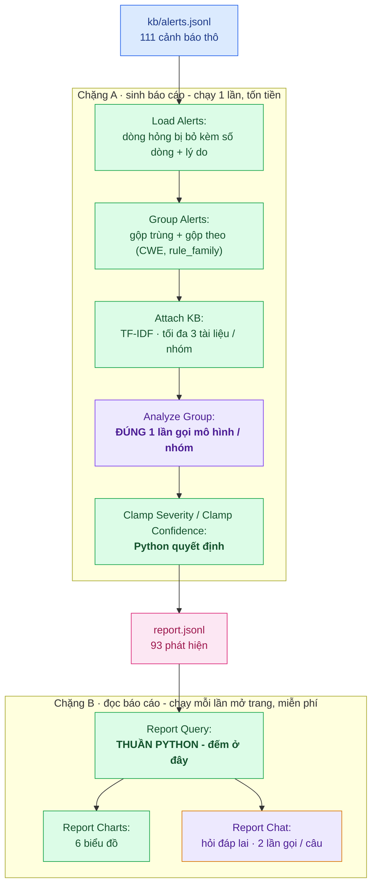
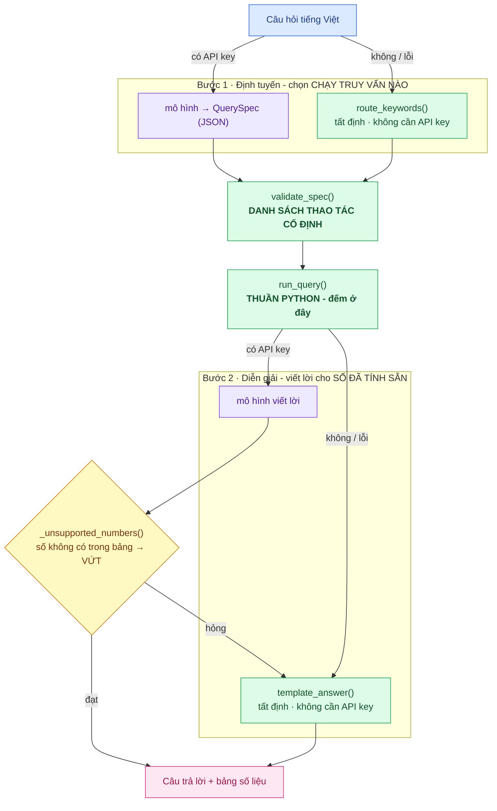

# Agent phân tích bảo mật - gộp nhóm, giải thích, và hỏi đáp trên báo cáo

## Mục tiêu

1. Biến **111 cảnh báo thô** thành **một báo cáo người thường đọc được**: gộp cảnh báo cùng loại thành nhóm, xếp mức nghiêm trọng, giải thích bằng tiếng Việt, kèm cách kiểm tra và cách sửa, có dẫn tài liệu từ kho tri thức tuần 2.
2. Đóng gói thành công cụ dòng lệnh **hỏng thì nói rõ là hỏng**: ba kiểu hỏng phải phân biệt được qua thông báo và qua mã thoát, không được im lặng.
3. Làm cho báo cáo **hỏi được**: 93 phát hiện là quá nhiều để đọc lần lượt, nên thêm một tầng truy vấn, sáu biểu đồ và một chatbot tiếng Việt — với một luật cứng: **mô hình không bao giờ là người đếm**.

Trang Security Report (là trang mặc định, nên nó nằm ngay ở URL gốc): [https://scan-benchmarkjava-production.up.railway.app](https://scan-benchmarkjava-production.up.railway.app)

## Sơ đồ tổng quan

Hai chặng, nối nhau bằng một tệp trên đĩa.

- Chặng A sinh báo cáo (chạy một lần, tốn tiền).
- Chặng B đọc báo cáo đó (chạy mỗi lần mở trang, miễn phí).

> Chú thích: Xanh lá = Python quyết định, tất định. Tím = mô hình. Viền vàng = lai: Python đếm, mô hình chỉ diễn giải con số. Hồng = tệp làm biên giữa hai chặng.

## 1. Agent được dùng tại những bước nào?

Mô hình chỉ được gọi ở **đúng một chỗ** trong cả chặng sinh báo cáo.

|                                           | Ai quyết định   | Ghi chú                                                        |
| ----------------------------------------- | --------------- | -------------------------------------------------------------- |
| Đọc & kiểm tra từng dòng                  | Python          | Dòng hỏng bị bỏ qua kèm số dòng + lý do, phần còn lại vẫn chạy |
| Gộp trùng chính xác                       | Python          | Cùng tool + file + dòng + rule_id                              |
| Gộp nhóm theo `(CWE, rule_family)`        | Python          | Tất định, nên `finding_id` ổn định giữa các lần chạy           |
| Tra kho tri thức                          | Python (TF-IDF) | Trả tối đa 3 tài liệu / nhóm                                   |
| Giải thích, cách kiểm tra, cách khắc phục | **Mô hình**     | Một lần gọi cho mỗi nhóm                                       |
| Mức nghiêm trọng cuối cùng                | Python          | Mô hình chỉ *đề xuất*, xem phần 11                             |
| Độ tin cậy cuối cùng                      | Python          | Mô hình chỉ *đề xuất*, có sàn cứng                             |
| File, số dòng, rule_id, CWE               | Python          | **Không bao giờ lấy từ mô hình**                               |

## 2. Mức nghiêm trọng, độ tin cậy, và chi phí

Đây là phân bố của **phát hiện**, khác với phân bố của *cảnh báo* ở báo cáo tuần 2, vì một nhóm gộp nhiều cảnh báo.

|                  |                                                                        |
| ---------------- | ---------------------------------------------------------------------- |
| Mức nghiêm trọng | **22** critical · **38** high · **26** medium · **7** low · 0 info     |
| Độ tin cậy       | 3 high · 74 medium · 16 low (gồm 3 fallback)                           |
| Nguồn phân tích  | mô hình **90**/93 · dự phòng **3**/93 (cả 3 do `transport_error`)      |
| Dẫn tài liệu KB  | 74 / 93 (79.6%) · có code gợi ý sửa: 87 / 93                           |
| Chi phí thật     | `deepseek-v4-pro` · **95** lần gọi · **482,344** token · **58.8 phút** |

---

# Phần mở rộng: đọc được báo cáo, không chỉ có báo cáo

93 phát hiện là danh sách quá dài để đọc lần lượt. Bản đầu của trang Security Report trả lời được *"có những gì"* nhưng không trả lời được *"critical có bao nhiêu, nằm ở tệp nào"*. Ba module dưới đây làm đúng việc đó — và làm theo cách **không để mô hình đếm**.

## 3. Tầng truy vấn

**Danh sách thao tác là cố định** — đây là tính chất quan trọng nhất. Bộ định tuyến, dù viết bằng từ khoá hay do mô hình sinh, **không thể xin một thao tác không có trong danh sách**: **7** thao tác (`overview`, `count_by`, `matrix`, `top_files`, `list_findings`, `lookup`, `kb_coverage`), **6** chiều thống kê (`severity`, `confidence`, `cwe`, `owasp`, `tool`, `analysis_source`) và **8** khoá lọc (6 chiều đó cộng `file` và `text`). Không `eval`, không tra thuộc tính bằng chuỗi, không cho khoá lạ đi qua. `validate_spec()` chạy trên **mọi** spec bất kể ai viết ra, nên `{'op': 'drop_table', …}` bị trả về `QuerySpecError: khoá thừa trong định tuyến: sql` y như một route viết tay sai.

Một khoá lọc lạ bị **từ chối** chứ không bị lặng lẽ bỏ qua. Vì một bộ lọc không làm gì còn tệ hơn một bộ lọc bị từ chối: con số đếm ra vẫn trông đầy thẩm quyền trong khi nó đang trả lời câu hỏi khác.

Hai bảo đảm được `assert` ngay trong mã, không phải chỉ ghi trong tài liệu:

- **Không mất phát hiện.** Với mọi `count_by`, tổng các hàng luôn bằng `total`. Phát hiện thiếu giá trị ở chiều đang đếm sẽ vào nhãn `không xác định` chứ **không biến mất** — 24/93 phát hiện không map được nhóm OWASP nào, và biểu đồ hiện đúng khoảng trống đó thay vì giấu đi.
- **Lần ngược được.** Mỗi `QueryResult` mang theo `finding_ids` — đúng những phát hiện mà câu trả lời dựa vào — nên một con số trên màn hình truy về được từng dòng của `report.jsonl`.

Riêng **ma trận** `severity × confidence` phải là một thao tác riêng, vì hai biểu đồ cột rời nhau không ghép lại được: "bao nhiêu phát hiện mức cao mà độ tin cậy thấp" không có trong biểu đồ nào. Mà đó đúng là ô cần cho việc chọn sửa gì trước — nhóm *trông* khẩn cấp nhưng bằng chứng yếu.

| severity ↓ / confidence → | high  | medium | low    | **Tổng** |
| ------------------------- | ----- | ------ | ------ | -------- |
| critical                  | 1     | 18     | 3      | **22**   |
| high                      | 1     | 34     | 3      | **38**   |
| medium                    | 1     | 17     | 8      | **26**   |
| low                       | 0     | 5      | 2      | **7**    |
| info                      | 0     | 0      | 0      | **0**    |
| **Tổng theo cột**         | **3** | **74** | **16** | **93**   |

Hai trục là **cố định**, không lấy từ spec: vừa vì cả hai đều do Python quyết định (mức bị kẹp ±1 bậc so với công cụ, độ tin cậy bị ép sàn khi bằng chứng mỏng), vừa để giữ danh sách thao tác thật sự đóng — không ai xin được một lưới `cwe × file` 25×69 mà không ai đọc nổi.

## 4. Sáu biểu đồ

Dashboard là **6 panel cố định**, khai báo một lần ở `DASHBOARD_PANELS`. Chatbot chọn được panel nào để hiện nhưng không bịa ra được panel thứ bảy, nên mọi biểu đồ trên màn hình đều đã có người duyệt.

| Panel                       | Truy vấn              | Đọc ra được gì                                                           |
| --------------------------- | --------------------- | ------------------------------------------------------------------------ |
| Mức độ nghiêm trọng         | `count_by severity`   | 22 critical · 38 high · 26 medium · 7 low                                |
| Nhóm OWASP Top 10           | `count_by owasp`      | A03 injection **27** · *không xác định* 24 · A02 crypto 19 · A10 SSRF 10 |
| Loại lỗi (CWE)              | `count_by cwe`        | CWE-89 **12** · CWE-209 10 · CWE-22 10 · CWE-15 7 (25 CWE)               |
| Tệp bị ảnh hưởng nhiều nhất | `top_files`           | Cao nhất 4 phát hiện / tệp, trên 69 tệp                                  |
| Độ tin cậy                  | `count_by confidence` | 3 high · 74 medium · 16 low                                              |
| Độ phủ kho tri thức         | `kb_coverage`         | 74/93 (79.6%) có trích dẫn                                               |

## 5. Hỏi đáp 

> Chú thích: cùng bộ màu với sơ đồ tổng quan — xanh lá = Python tất định, tím = mô hình, hồng = đầu ra. Vàng = cổng chặn bịa số, chỗ duy nhất có đường quay lui: lời văn của mô hình bị loại thì rơi về `template_answer()`.

### Đường không cần API key

1. Bản deploy trả lời được mà **không tốn đồng nào**, và số liệu không đổi vì chúng chưa bao giờ do mô hình sinh ra.
2. **Câu ngoài phạm vi vẫn có câu trả lời thật:** "xin chào bạn khoẻ không" thành `overview` chứ không thành thông báo lỗi. Một câu trả lời tổng quan đúng tốt hơn một lời từ chối.
3. Bộ định tuyến từ khoá xếp `matrix` **lên trước** vòng lặp chiều thống kê, vì "ma trận mức độ và độ tin cậy" chứa cả hai từ khoá chiều — để vòng lặp chạy trước thì cái đầu tiên thắng và trả về một biểu đồ cột một chiều, đúng một nửa câu hỏi.

## 6. Trang Security Report 

Đây cũng là **trang mặc định** của app, và tab đầu là **Hỏi đáp** — người mở web rơi thẳng vào khung câu hỏi chứ không vào một bảng KPI.

| Tab                    | Nội dung                                                                                                                                                                      |
| ---------------------- | ----------------------------------------------------------------------------------------------------------------------------------------------------------------------------- |
| **Hỏi đáp** (mặc định) | Chatbot tiếng Việt, 7 câu hỏi gợi ý **trả lời sẵn** (mỗi câu chạm một `op` khác nhau), khung "câu trả lời này được tạo ra thế nào?", và **danh sách phát hiện** ngay bên dưới |
| **Tổng quan**          | Hàng KPI · ma trận `severity × confidence` có tô nền theo 4 dải · 6 biểu đồ                                                                                                   |

## 7. Ba kịch bản hỏng, chạy thật ở dòng lệnh

Ba kiểu hỏng phân biệt được bằng **thông báo** và bằng **mã thoát**. Output thật, chạy lại ngày 2026-08-07.

| Kịch bản                 | Trạng thái      | Mã thoát | Thông báo quan trọng nhất                                                                          |
| ------------------------ | --------------- | -------- | -------------------------------------------------------------------------------------------------- |
| Đầu vào rỗng             | `empty`         | **0**    | *"Đầu vào RỖNG (không phải 'không tìm thấy lỗ hổng') — hãy kiểm tra lại --input."*                 |
| Mọi bản ghi đều hỏng     | `invalid_input` | **2**    | Liệt kê từng dòng hỏng kèm **số dòng 1-based** + lý do; `0 + 0 + 3 == 3` vẫn cân                   |
| Endpoint hỏng (mọi nhóm) | `degraded`      | **3**    | *"SUY GIẢM: … mọi phát hiện đều gắn nhãn fallback, nhưng đây KHÔNG phải một lần chạy thành công."* |

## 8. Hạn chế

| Hạn chế                                       | Chi tiết                                                                                                                                                                                      |
| --------------------------------------------- | --------------------------------------------------------------------------------------------------------------------------------------------------------------------------------------------- |
| Độ tin cậy `high` gần như không với tới được  | `high` cần tài liệu KB khớp **cộng** (nhiều lần xuất hiện **hoặc** nhiều công cụ cùng báo). Thực tế 93/93 nhóm có ≥1 tài liệu KB nhưng chỉ **4**/93 có nhiều lần xuất hiện → trần 4/93 (4.3%) |
| Nhánh "nhiều công cụ" không bao giờ chạy      | 97 cảnh báo Metis + 14 Semgrep, nhưng 90 nhóm thuần Metis, 3 thuần Semgrep, **0 nhóm hỗn hợp** — hai công cụ đặt `rule_id` khác quy ước nên không bao giờ trùng khoá nhóm                     |
| Truy hồi KB chỉ là TF-IDF từ khoá             | 19 phát hiện không có trích dẫn **đều** đã được truy hồi 3 tài liệu, mô hình chủ động không trích — và nó đúng: với `CWE-15`, TF-IDF trả `insecure-cookie` chỉ vì trùng từ vựng               |
| 79.6% đo kho tri thức, không đo agent         | KB có 23 tài liệu, thiếu hẳn 12 CWE trong nhóm 19 phát hiện đó. Cùng lỗ hổng này hiện lên biểu đồ OWASP thành 24 phát hiện "không xác định". Đã ghi vào `DEBT.md`                             |
| Bộ chặn bịa số cố tình chặt tay               | Loại cả phép cộng đúng ("ba nhóm đầu chiếm 70 phát hiện") — mất chất lượng lời văn để đổi lấy một bảo đảm máy kiểm tra được                                                                   |
| Định tuyến từ khoá hẹp hơn định tuyến mô hình | *"mức cao mà độ tin cậy thấp có bao nhiêu?"* đúng ra phải thành `matrix`, từ khoá lại cho `count_by confidence` + lọc `severity=high`: có đúng con số cần (3) nhưng sai hình dạng             |
| Chatbot không có trí nhớ hội thoại            | "còn cái kia thì sao?" sẽ không hiểu. Có chủ đích: giữ chi phí mỗi lượt biết trước (đúng 2 lần gọi) và giữ mọi lượt tái lập được                                                              |
| Một mô hình, một phiên bản prompt, không A/B  | Mọi số liệu đến từ **đúng một** cấu hình `deepseek-v4-pro` + prompt `1.0.0`. Hạ tầng so sánh đã có sẵn, chỉ là chưa chạy                                                                      |
| Vá zero-token mới chỉ ở agent phân tích       | `scripts/bench.py`, `sweep.py`, `ablation.py` **vẫn chưa** có bảo vệ này — mà sự cố tuần 2 xảy ra ở chính ba script đó                                                                        |
