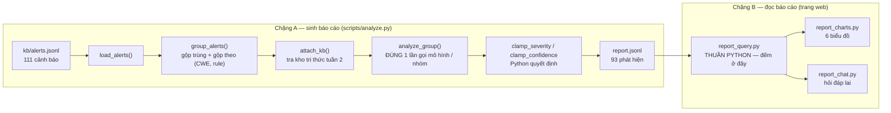
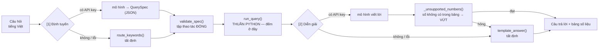

# Agent phân tích bảo mật — gộp nhóm, giải thích, và hỏi đáp trên báo cáo

## Mục tiêu

1. Biến **111 cảnh báo thô** trong `data/kb/alerts.jsonl` thành một **báo cáo người đọc
   được**: gộp các cảnh báo cùng loại thành nhóm, phân loại mức nghiêm trọng, giải thích
   bằng tiếng Việt, kèm cách kiểm tra và cách khắc phục, có trích dẫn tài liệu từ kho tri
   thức tuần 2. *(phần 1–4)*
2. Đóng gói thành công cụ dòng lệnh `scripts/analyze.py` với **hành vi thất bại trung thực** —
   ba kịch bản hỏng phải phân biệt được bằng thông báo và bằng mã thoát, không được im lặng.
   *(phần 5, 9)*
3. Làm cho báo cáo **hỏi được**: 93 phát hiện là quá nhiều để đọc tuần tự, nên thêm một
   tầng truy vấn tất định, sáu biểu đồ, và một chatbot tiếng Việt — với ràng buộc rằng
   **mô hình không bao giờ là người đếm**. *(phần 6–8)*

Trang Security Report:
[https://scan-benchmarkjava-production.up.railway.app/security-report](https://scan-benchmarkjava-production.up.railway.app/security-report)

## Sơ đồ tổng quan

Hai chặng, nối nhau bằng một tệp trên đĩa. Chặng A sinh báo cáo (chạy một lần, tốn tiền);
chặng B đọc báo cáo đó (chạy mỗi lần mở trang, gần như miễn phí).



Đây là **pipeline có biên**, không phải agent tự vòng lặp: không tool-calling, không đa
lượt, không tự đọc file. Nhờ vậy chi phí biết trước được (93 nhóm → 93 lần gọi; mỗi câu hỏi
→ đúng 2 lần gọi) và phần lớn logic kiểm thử được offline — **164 test chạy không tốn một
đồng nào**.

## 1. Agent là gì, và phần nào KHÔNG phải mô hình

`src/security_agent.py` (1263 dòng) là module thư viện, không có `st.*`, không có `argparse`,
không có `sys.exit`. Mô hình chỉ được gọi ở đúng **một** chỗ trong toàn bộ pipeline sinh báo cáo.

| Bước | Ai quyết định | Ghi chú |
| --- | --- | --- |
| Đọc & kiểm tra từng dòng | Python | Dòng hỏng bị bỏ qua kèm số dòng + lý do, phần còn lại vẫn chạy |
| Gộp trùng chính xác | Python | Cùng tool + file + dòng + rule_id |
| Gộp nhóm theo `(CWE, rule_family)` | Python | Tất định, nên `finding_id` ổn định giữa các lần chạy |
| Tra kho tri thức | Python (TF-IDF) | Trả tối đa 3 tài liệu / nhóm |
| Giải thích, cách kiểm tra, cách khắc phục | **Mô hình** | Một lần gọi cho mỗi nhóm |
| Mức nghiêm trọng cuối cùng | Python | Mô hình chỉ *đề xuất*, xem phần 10.1 |
| Độ tin cậy cuối cùng | Python | Mô hình chỉ *đề xuất*, có sàn cứng |
| File, số dòng, rule_id, CWE | Python | **Không bao giờ lấy từ mô hình** |

Dòng cuối là quan trọng nhất. Mô hình thậm chí không được *nhận* đường dẫn file hay số dòng
trong prompt — không đưa cho nó là cách rẻ nhất để nó không thể trả lại như thể tự tìm ra. Nếu
nó vẫn tự bịa ra một đường dẫn, đoạn đó bị vứt bỏ. Kiểm chứng trên toàn bộ 93 phát hiện:
**0 đường dẫn bịa, 0 cặp (file, dòng) không có trong dữ liệu vào, 0 mã tài liệu KB không tồn
tại.**

## 2. Hai System Prompt, đều là file nguồn có version

Prompt không phải chuỗi nhúng trong code — chúng là file nguồn, được hash, và hash được ghi
vào kết quả:

| File | Vai trò | Version | sha256 |
| --- | --- | --- | --- |
| `src/prompts/security_analyst.md` | Sinh báo cáo (1 vai) | `1.0.0` | `8b8356c3…` |
| `src/prompts/report_chat.md` | Hỏi đáp (2 vai: Định tuyến, Diễn giải) | `1.1.0` | `2b89c6a5…` |

- Nằm trong `src/` chứ không phải `docs/` **có chủ đích**: `.dockerignore` loại `/docs/`, nên
  một prompt đặt ở đó sẽ không có mặt trong image đã deploy.
- `sha256` được ghi vào **mọi báo cáo**, vào **từng phát hiện**, và vào **từng lượt hội thoại**.
  Nghĩa là "kết quả thay đổi" luôn có lời giải thích: hoặc prompt đổi (hash đổi), hoặc không.
- Không có prompt mặc định ẩn. File thiếu hoặc rỗng → `PromptMissingError`, agent từ chối chạy
  chứ không âm thầm dùng một prompt nội bộ nào đó.
- `report_chat.md` là **một file hai section** chứ không phải hai file. Hai vai (định tuyến và
  diễn giải) chia nhau một luật chung viết ở đầu file — *"bạn không bao giờ là người đếm"* —
  nên một `version:` và một sha256 mô tả trọn vẹn hành vi hội thoại.

Prompt phân tích yêu cầu: viết tiếng Việt dễ hiểu (khoá và enum trong JSON vẫn là tiếng Anh);
chỉ dùng tài liệu KB và thông điệp công cụ được cung cấp; **không bịa** đường dẫn/số dòng/rule/CWE;
severity và confidence chỉ là *đề xuất* kèm lý do; trả về đúng một đối tượng JSON.

## 3. Từ 111 cảnh báo đến 93 phát hiện

Phép cộng bảo toàn được in ra mỗi lần chạy, dưới dạng biểu thức đã tính:

```
Bảo toàn: 109 + 2 + 0 == 111 -> True (meta.accounted_for=True)
```

Đọc là: **109** lần xuất hiện còn lại trong các nhóm **+ 2** bản trùng chính xác đã gộp
**+ 0** dòng hỏng bị bỏ qua **= 111** dòng đã đọc. Không có gì rơi mất mà số học không lên
tiếng — đây là cách chứng minh việc gộp nhóm không làm mất dữ liệu, thay vì chỉ nói suông.

| | Số lượng |
| --- | --- |
| Dòng đọc vào | **111** |
| Hợp lệ | 111 |
| Bỏ qua (hỏng) | 0 |
| Trùng chính xác, đã gộp | 2 |
| Nhóm | **93** |
| Phát hiện ghi ra | **93** |
| CWE khác nhau | 25 |
| Tệp có ít nhất 1 phát hiện | 69 |

Nhóm lớn nhất gộp 10 cảnh báo — `CWE-330`, dùng `java.util.Random` làm nguồn ngẫu nhiên cho
mục đích bảo mật. Đó chính là giá trị của việc gộp: 10 dòng cảnh báo rời rạc trở thành **một**
việc cần sửa, kèm danh sách 10 vị trí.

Tỉ lệ gộp thực tế khiêm tốn (111 → 93). Lý do: khoá nhóm là `(CWE, rule_family)`, mà Metis
sinh `rule_id` mô tả rất chi tiết theo từng ca, nên hai cảnh báo cùng CWE thường vẫn khác
`rule_family`. Nói thẳng: việc gộp hiệu quả rõ rệt ở lớp lỗi lặp nhiều (weak PRNG, DES), còn
với phần đuôi dài thì gần như một-đổi-một.

## 4. Mức nghiêm trọng, độ tin cậy, và nguồn phân tích

Phân bố mức nghiêm trọng của **phát hiện** (khác với phân bố của *cảnh báo* ở báo cáo tuần 2,
vì một nhóm gộp nhiều cảnh báo):

| | critical | high | medium | low | info |
| --- | --- | --- | --- | --- | --- |
| Phát hiện | **22** | **38** | **26** | **7** | 0 |

Độ tin cậy và nguồn phân tích:

| | Số lượng | |
| --- | --- | --- |
| Mô hình phân tích (`llm`) | **90** / 93 | |
| Dự phòng (`fallback`) | **3** / 93 | cả 3 do `transport_error` |
| Tin cậy `high` | 3 | |
| Tin cậy `medium` | 74 | |
| Tin cậy `low` | 16 | gồm 3 phát hiện fallback |
| Có trích dẫn tài liệu KB | 74 / 93 (79.6%) | |
| Có đoạn code gợi ý sửa | 87 / 93 | |

Ba phát hiện `fallback` **không** trộn lẫn vào 90 phát hiện kia: chúng được gắn nhãn rõ trên
trang web ("Không có phân tích từ mô hình cho nhóm này"), độ tin cậy bị ép xuống `low`, và
phần giải thích tự nói ra rằng nó được ghép tự động từ tài liệu KB cộng thông điệp của công cụ.

**Về việc kẹp mức nghiêm trọng:** mô hình đã dịch chuyển mức ở **15/90** phát hiện, tất cả đều
đúng 1 bậc (ví dụ `high → critical` cho một khoá `remember-me` sinh bằng `java.util.Random`;
`medium → high` cho MD5 dùng lưu mật khẩu). Cả 15 đều nằm trong biên cho phép, nên **`severity_clamped`
là `false` ở cả 93 phát hiện** — nói cách khác, cơ chế kẹp lần này *không phải* can thiệp lần
nào. Đó là dữ kiện, không phải bằng chứng rằng cơ chế thừa: nó chỉ chứng minh mô hình đã cư xử
trong biên ở tập dữ liệu này. Việc kẹp hoạt động đúng được chứng minh riêng bằng bảng chân trị
25 cặp enum trong test.

## 5. Chi phí thật của lần sinh báo cáo

| | Giá trị |
| --- | --- |
| Mô hình | `deepseek-v4-pro` |
| Lần gọi | **95** (93 nhóm + 2 lần thử lại do JSON sai lược đồ) |
| Token | **482,344** (~5,077 / lần gọi) |
| Thời gian | **3,530 giây ≈ 58.8 phút** (~38 giây / nhóm) |
| Thất bại | 3 (`transport_error`) |

`llm_calls` (95) lớn hơn số nhóm (93) đúng bằng số lần thử lại — mỗi phản hồi sai lược đồ được
gọi lại **một** lần duy nhất kèm mô tả lỗi cụ thể, rồi mới rơi về fallback. Ngân sách thử lại
là 1, không phải vòng lặp.

---

# Phần mở rộng: đọc được báo cáo, không chỉ có báo cáo

93 phát hiện là một danh sách quá dài để đọc tuần tự. Trang Security Report bản đầu trả lời
được *"có những gì"* nhưng không trả lời được *"mức critical có bao nhiêu, và nằm ở tệp nào"*.
Ba module dưới đây giải quyết đúng câu đó — và giải quyết theo cách **không để mô hình đếm**.

## 6. Tầng truy vấn tất định — `src/report_query.py`

752 dòng, thuần Python, **0 mạng, 0 Streamlit, 0 I/O**. Mọi hàm là ánh xạ thuần từ một
`AnalysisReport` đã nạp sang một `QueryResult`.

### Tập thao tác đóng

Đây là tính chất quan trọng nhất của module: một bộ định tuyến — dù là từ khoá hay mô hình —
**không thể yêu cầu một thao tác không tồn tại**. Không có `eval`, không tra thuộc tính bằng
chuỗi, không cho khoá lạ đi qua.

| Thành phần | Số lượng | Giá trị |
| --- | --- | --- |
| Thao tác (`op`) | **7** | `overview` · `count_by` · `matrix` · `top_files` · `list_findings` · `lookup` · `kb_coverage` |
| Chiều thống kê | **6** | `severity` · `confidence` · `cwe` · `owasp` · `tool` · `analysis_source` |
| Khoá lọc | **8** | 6 chiều trên + `file` + `text` |

`validate_spec()` chạy trên **mọi** spec bất kể xuất xứ — một route viết tay bị soi kỹ đúng
như một route do mô hình viết. Đó chính là thứ làm hai đường thay thế được cho nhau:

```
>>> rq.spec_from_dict({'op': 'drop_table', 'sql': 'select 1'})
QuerySpecError: khoá thừa trong định tuyến: sql

>>> rq.spec_from_dict({'op': 'count_by', 'dimension': 'password'})
QuerySpecError: chiều thống kê không hợp lệ: 'password'
                (hợp lệ: severity, confidence, cwe, owasp, tool, analysis_source)
```

Một khoá lọc lạ bị **từ chối** chứ không bị lặng lẽ bỏ qua. Lý do: một bộ lọc không làm gì
còn tệ hơn một bộ lọc bị từ chối, vì con số đếm ra vẫn trông đầy thẩm quyền trong khi nó đang
trả lời một câu hỏi khác.

### Bảo toàn và truy vết

Hai bảo đảm được `assert` ngay trong mã, không phải chỉ ghi trong tài liệu:

- **Bảo toàn.** Với mọi `count_by`, `sum(row["count"]) == result.total`. Một phát hiện thiếu
  giá trị ở chiều đang đếm sẽ vào nhãn `không xác định` chứ **không biến mất** — 24/93 phát
  hiện không map được nhóm OWASP nào, và biểu đồ hiện đúng khoảng trống đó thay vì giấu đi.
- **Truy vết.** Mọi `QueryResult` mang theo `finding_ids` — đúng những phát hiện mà câu trả
  lời dựa vào — nên một khẳng định trên màn hình lần ngược được về từng dòng của `report.jsonl`.

### Ma trận `severity × confidence`

`count_by severity` và `count_by confidence` mỗi cái trả lời một nửa, và **không ghép lại được
sau đó**: "bao nhiêu phát hiện mức cao mà độ tin cậy thấp" không có trong biểu đồ nào ở trên.
Đó lại đúng là ô mà việc phân loại ưu tiên cần — nhóm *trông* khẩn cấp nhưng bằng chứng yếu.

| severity ↓ / confidence → | high | medium | low | **Tổng** |
| --- | --- | --- | --- | --- |
| critical | 1 | 18 | 3 | **22** |
| high | 1 | 34 | 3 | **38** |
| medium | 1 | 17 | 8 | **26** |
| low | 0 | 5 | 2 | **7** |
| info | 0 | 0 | 0 | **0** |
| **Tổng theo cột** | **3** | **74** | **16** | **93** |

Hai trục là **cố định**, không lấy từ spec. Vừa vì cả hai đều do Python quyết định (mức bị kẹp
±1 bậc so với công cụ, độ tin cậy bị ép sàn khi bằng chứng mỏng), vừa để giữ tập thao tác thật
sự đóng: không bộ định tuyến nào — từ khoá hay mô hình — xin được một lưới `cwe × file`
25×69 mà không ai đọc nổi.

## 7. Sáu biểu đồ — `src/report_charts.py`

185 dòng, hàm thuần từ `QueryResult` sang spec Altair, nên vẽ được và **assert được trong test**
(`chart.to_dict()`) mà không cần trình duyệt hay app đang chạy. Altair không phải dependency
mới — Streamlit đã có sẵn; `pyproject.toml` không thêm gì.

Hai luật, kế thừa từ DESIGN.md chứ không phải nghĩ ra ở đây:

- **Màu là phần củng cố, không bao giờ là thông tin.** Mọi cột đều in sẵn nhãn và con số bằng
  chữ; sắc độ theo mức nghiêm trọng chỉ lặp lại điều trục đã nói. Biểu đồ sống sót qua bản in
  đen trắng và qua mắt người mù màu — đúng luật đã áp cho bảng kết quả.
- **Biểu đồ vẽ đúng cái bảng, và chỉ cái bảng đó.** Nó không tự gộp lại, không tự sắp xếp
  theo khoá ẩn, không tự lọc. Nếu con số trên cột khác con số trong bảng ngay dưới nó thì đó
  là **bug của file này**, không phải chuyện quan điểm.

Dashboard là **6 panel cố định**, khai báo một lần ở `DASHBOARD_PANELS`. Đóng có chủ đích:
chatbot chọn được panel nào để hiện, nhưng không bịa ra được panel thứ bảy — nên mọi biểu đồ
trên màn hình đều là biểu đồ đã có người duyệt.

| Panel | Truy vấn | Đọc ra được gì |
| --- | --- | --- |
| Mức độ nghiêm trọng | `count_by severity` | 22 critical · 38 high · 26 medium · 7 low |
| Nhóm OWASP Top 10 | `count_by owasp` | A03 injection **27** · *không xác định* 24 · A02 crypto 19 · A10 SSRF 10 |
| Loại lỗi (CWE) | `count_by cwe` | CWE-89 **12** · CWE-209 10 · CWE-22 10 · CWE-15 7 (25 CWE) |
| Tệp bị ảnh hưởng nhiều nhất | `top_files` | Cao nhất 4 phát hiện / tệp, trên 69 tệp |
| Độ tin cậy | `count_by confidence` | 3 high · 74 medium · 16 low |
| Độ phủ kho tri thức | `kb_coverage` | 74/93 (79.6%) có trích dẫn |

Con số **24 phát hiện "không xác định" nhóm OWASP** là ví dụ rõ nhất cho luật "gán nhãn chứ
không vứt": nó chiếm hạng hai trong biểu đồ, và nó là một sự thật đáng biết về độ phủ của kho
tri thức chứ không phải một hàng nên giấu.

`is_chartable()` từ chối vẽ khi mọi hàng đều bằng 0 — một biểu đồ toàn số 0 là một hình chữ
nhật rỗng, và hình chữ nhật rỗng bị đọc thành "lỗi render" chứ không thành "không có gì khớp".

## 8. Hỏi đáp lai — `src/report_chat.py`

405 dòng. Cùng một cách chia việc mà agent phân tích đã dùng cho báo cáo, nay áp cho hội thoại:



Mô hình chỉ làm hai việc: chọn *truy vấn nào* để chạy, và viết lời cho *kết quả đã tính sẵn*.
Nó không bao giờ nhìn thấy 93 phát hiện cùng lúc và không bao giờ cộng gì.

### Bộ chặn bịa số — chỗ biến lời dặn thành ràng buộc

Prompt có dặn "không được tự tính". Nhưng lời dặn trong prompt không phải bảo đảm. Cái làm nó
thành bảo đảm là `_unsupported_numbers()`: quét mọi số nguyên trong câu trả lời của mô hình,
so với tập số mà bảng giải thích được (các ô trong bảng, tổng, số nhúng trong nhãn như mã CWE,
phần trăm suy ra đúng, và số nhỏ ≤10 kiểu "ba nhóm đầu"). Thấy số lạ thì **vứt cả đoạn văn**
và rơi về mẫu.

Thử trên chính bảng OWASP ở trên:

```
Câu do mô hình viết : "Ba nhóm đầu chiếm 70 phát hiện trong tổng số 93."
_unsupported_numbers → [70]                                       ← bị loại

Câu hợp lệ          : "Nhóm A03 injection dẫn đầu với 27 phát hiện,
                       và 24 phát hiện chưa map được nhóm nào."
_unsupported_numbers → []                                         ← được nhận
```

70 = 27 + 24 + 19. Nó **đúng số học**. Nó vẫn bị loại, vì nếu chấp nhận mọi tổng con thì bảo
đảm "mô hình không đếm" không còn kiểm tra được bằng máy nữa. Đây là đánh đổi có chủ đích, ghi
rõ ở phần hạn chế.

Cùng tinh thần với việc agent phân tích vứt một đường dẫn file do mô hình bịa: thứ không kiểm
chứng được thì không được lên màn hình.

### Hai lần gọi, cả hai đều không bắt buộc và hỏng riêng lẻ được

Định tuyến hỏng → `route_keywords()`. Diễn giải hỏng → `template_answer()`. Mỗi `ChatTurn` ghi
lại nó đã đi đường nào (`route_source` / `answer_source` / `route_failure` / `answer_failure`),
và trang web hiện đúng thông tin đó trong khung "Câu trả lời này được tạo ra thế nào?" — một
câu trả lời do mẫu dựng **không bao giờ** được nhận nhầm là do mô hình viết.

Tập lý do thất bại là **tập đóng** (`no_credentials`, `prompt_missing`, `non_json`,
`spec_invalid`, `unsupported_number` + các lý do transport), cùng kỷ luật với
`security_agent.FAILURE_REASONS`: một lý do được đếm hơn hẳn một lý do phải đi grep log.

### Đường tất định chạy thật, không có API key

Đây là output thật, chạy với mọi biến môi trường bị gỡ (`env -u OPENCODE_API_KEY -u OPENCODE_BASE_URL`),
tức đúng trạng thái vĩnh viễn của bản deploy công khai:

```
Q: Phân bố theo mức độ nghiêm trọng ra sao?
   spec  : {"op": "count_by", "dimension": "severity", "filters": {}, "limit": 10}
   đường : route=keyword (no_credentials) · answer=template (no_credentials) · tokens=0
   A     : Trong 93 phát hiện, phân bố theo `severity` là — **critical**: 22,
           **high**: 38, **medium**: 26, **low**: 7.

Q: Ma trận mức độ và độ tin cậy trông thế nào?
   spec  : {"op": "matrix", "dimension": null, "filters": {}, "limit": 10}
   A     : Ma trận `severity` × `confidence` trên 93 phát hiện. Ô lớn nhất là mức
           **high** với độ tin cậy **medium**: 34 phát hiện.

Q: Liệt kê các lỗi CWE-89
   spec  : {"op": "list_findings", "dimension": null, "filters": {"cwe": "CWE-89"}, "limit": 10}
   A     : Có 12 phát hiện khớp; bảng dưới hiện 10 phát hiện, xếp theo mức độ
           nghiêm trọng rồi tới số lần xuất hiện.

Q: xin chào bạn khoẻ không
   spec  : {"op": "overview", "dimension": null, "filters": {}, "limit": 10}
   A     : Tổng quan báo cáo hiện tại: - Tổng số phát hiện: **93** - …
```

Ba điều đáng chú ý ở output này:

1. **`tokens=0` ở mọi lượt.** Bản deploy trả lời được mà không tốn gì, và **biểu đồ với số
   liệu không đổi** — chúng chưa bao giờ do mô hình sinh ra.
2. **Câu hỏi ngoài phạm vi vẫn có câu trả lời thật.** "Xin chào bạn khoẻ không" thành
   `overview` chứ không thành thông báo lỗi. Một câu trả lời tổng quan đúng tốt hơn một lời
   từ chối.
3. **Bộ định tuyến từ khoá xếp `matrix` lên trên vòng lặp chiều thống kê** có lý do: "ma trận
   mức độ và độ tin cậy" chứa cả hai từ khoá chiều, và nếu để vòng lặp chạy trước thì cái đầu
   tiên thắng và trả về một biểu đồ cột một chiều — đúng một nửa câu hỏi.

`template_answer()` chạy hai lần trên cùng 7 câu hỏi cho ra **hash giống hệt**
(`410766942891025c…`): đường tất định tái lập được từng byte.

## 9. Trang Security Report — ba tab

Trang đọc dữ liệu **chỉ** qua `security_agent.load_report()` — `app.py` không mở file nào dưới
`data/analysis/`, không tự parse JSONL, không gọi endpoint, và **không tự cộng con số nào**
(mọi số đi qua `report_query`).

| Tab | Nội dung |
| --- | --- |
| **Tổng quan** | Hàng KPI · ma trận `severity × confidence` có tô nền theo 4 dải · 6 biểu đồ |
| **Hỏi đáp** | Chatbot tiếng Việt, 7 câu hỏi gợi ý (mỗi câu chạm một `op` khác nhau), khung "câu trả lời này được tạo ra thế nào?" |
| **Danh sách phát hiện** | Bản cũ giữ nguyên: lọc theo mức / độ tin cậy / tìm theo tiêu đề, CWE, tên tệp |

- Mỗi phát hiện là một expander, thứ tự cố định: Vị trí → Bằng chứng từ công cụ quét (nguyên
  văn) → Giải thích → Cách kiểm tra → Cách khắc phục (+ đoạn code) → Tài liệu KB → Mức độ tin cậy.
- **Bảng số liệu luôn hiện ngay dưới mỗi câu trả lời và mỗi biểu đồ.** Bảng không phải trang
  trí: nó là thứ làm một khẳng định trên trang **đối chiếu được tại chỗ**.
- Mọi nhãn mức nghiêm trọng đều **in ra chữ**, không chỉ tô màu (WCAG `color-not-only`). Ô 0
  trong ma trận được làm xám thay vì tô dải nhạt nhất — một ô rỗng phải đọc ra là rỗng.
- Bản deploy **không có** `OPENCODE_API_KEY`: nó phục vụ một báo cáo đã nướng sẵn trong image
  và về mặt cấu trúc không thể tự sinh ra báo cáo, đúng như nó không thể tự chạy quét.

## 10. Kiểm thử: 164 test, 0 lần gọi mạng

```
$ env -u OPENCODE_API_KEY -u OPENCODE_BASE_URL -u CUSTOM_SCAN_MODEL uv run pytest tests/ -q
164 passed in 2.58s
```

| Bộ test | Số test | Nội dung chính |
| --- | --- | --- |
| `tests/test_security_agent.py` | **76** | Đọc/kiểm tra dòng hỏng · gộp nhóm · bảng chân trị 25 cặp enum cho việc kẹp mức · sàn độ tin cậy · chống bịa đường dẫn · zero-token |
| `tests/test_report_query.py` | **88** | Tập thao tác đóng · bảo toàn trên cả 6 chiều · bộ lọc · spec do mô hình bịa · bộ chặn bịa số · spec Altair · mọi đường fallback của chat |

Cả hai file dùng fixture `_offline` tự động thay `requests.post` bằng một hàm ném lỗi: **một
test cố gọi mạng thật sẽ fail**. Test nào muốn chạy đường mô hình thì phải stub `_post_chat`
tường minh, nên nó nhìn ra được ngay là đang chạy giả.

Test của tầng truy vấn chạy trên **chính `data/analysis/report.jsonl` đã commit** — cùng byte
mà trang deploy phục vụ — nên con số được assert trong test là con số người đọc nhìn thấy.

## 11. Ba kịch bản hỏng, chạy thật ở dòng lệnh

Mã thoát bám đúng bảng trạng thái trong hợp đồng. Đây là output thật chạy lại ngày 2026-08-07,
không phải mô tả.

### Kịch bản 1 — đầu vào rỗng (phải là "rỗng", không phải "không có lỗ hổng")

```
$ ./scripts/analyze.py --input tests/fixtures/alerts_empty.jsonl --no-llm --out /tmp/sc1

Bảo toàn: 0 + 0 + 0 == 0 -> True (meta.accounted_for=True)
Trạng thái: empty
Nguồn vào: tests/fixtures/alerts_empty.jsonl (0 dòng đọc, 0 hợp lệ, 0 bỏ qua) -> 0 nhóm -> 0 phát hiện
...
Đầu vào RỖNG (không phải 'không tìm thấy lỗ hổng') — hãy kiểm tra lại đường dẫn --input.

$ echo $?
0
```

Mã thoát `0` vì đây không phải lỗi của chương trình — nhưng thông báo **từ chối** cách đọc
"quét sạch, không có lỗ hổng". Một đường dẫn không tồn tại cho kết quả y hệt, không ném exception.

Cùng nguyên tắc đó chạy suốt lên tầng hỏi đáp: một bộ lọc không khớp gì trả về

> *"Không có phát hiện nào khớp với điều kiện này. Lưu ý: điều đó có nghĩa là **bộ lọc không
> khớp gì**, không phải là **không có lỗ hổng**."*

Và cả 7 thao tác đều chạy được trên một báo cáo rỗng (`total=0`) mà không ném exception —
`overview` vẫn ra 8 hàng, `matrix` vẫn ra đủ 5 hàng thang mức, `count_by` vẫn ra đủ 5 bậc.

### Kịch bản 2 — mọi bản ghi đều hỏng

```
$ ./scripts/analyze.py --input tests/fixtures/alerts_all_invalid.jsonl --no-llm --out /tmp/sc2

Bảo toàn: 0 + 0 + 3 == 3 -> True (meta.accounted_for=True)
Trạng thái: invalid_input
Nguồn vào: tests/fixtures/alerts_all_invalid.jsonl (3 dòng đọc, 0 hợp lệ, 3 bỏ qua) -> 0 nhóm -> 0 phát hiện
Dòng bị bỏ qua:
  - dòng 1: invalid json
      not json at all
  - dòng 2: invalid json
      {"tool": "semgrep", "severity": "medium"
  - dòng 3: not an object
      ["bare", "array"]
...
Mọi dòng đọc được đều hỏng — không ghi phát hiện nào. Xem danh sách dòng bị bỏ qua ở trên.

$ echo $?
2
```

Mỗi dòng hỏng có **số dòng 1-based** và lý do thuộc tập đóng. Phép cộng bảo toàn vẫn cân
(`0 + 0 + 3 == 3`): dòng bị bỏ qua vẫn được tính, không biến mất.

### Kịch bản 3 — endpoint hỏng

```
$ OPENCODE_BASE_URL="http://127.0.0.1:9/does-not-exist" \
  ./scripts/analyze.py --input tests/fixtures/alerts_single.jsonl -y --out /tmp/sc3
Lần chạy này sẽ gọi mô hình trả phí 1 lần (mỗi nhóm cảnh báo một lần, mô hình deepseek-v4-pro),
trên tổng số 1 nhóm.
[1/1] CWE-330::util-random
analysis call failed in transport: ... Connection refused

Bảo toàn: 1 + 0 + 0 == 1 -> True (meta.accounted_for=True)
Trạng thái: degraded
Nguồn phân tích: llm=0, fallback=1
Lần gọi mô hình: 1, thất bại: 1
  - transport_error: 1
...
SUY GIẢM: bật LLM nhưng MỌI nhóm đều rơi về fallback. Báo cáo vẫn được ghi và mọi phát hiện
đều gắn nhãn fallback, nhưng đây KHÔNG phải một lần chạy thành công.

$ echo $?
3
```

Suy giảm **một phần** vẫn là `ok` (như lần chạy thật: 3/93 hỏng, vẫn `ok`). Suy giảm **toàn
bộ** thì `degraded` và thoát khác 0 — một báo cáo toàn fallback không được phép trông giống
một lần chạy thành công, kể cả với script tự động chỉ đọc mã thoát.

### Trường hợp thứ tư: 200 nhưng 0 token (ADR 30)

Đây là chính xác sự cố tuần 2 mà `README.md` vẫn liệt kê là *chưa khắc phục*. Kiểm chứng bằng
một HTTP server thật luôn trả `200` với thân JSON **hợp lệ** nhưng `usage.total_tokens: 0`:

```
analysis call returned 2xx but reported zero tokens — treating as failure
status              : degraded
llm_failure_reasons : {'zero_tokens': 1}
finding df7df7f4f623: analysis_source=fallback confidence=low
```

Phản hồi đó **hợp lệ về lược đồ** và lẽ ra đã được chấp nhận. Nó bị từ chối chỉ vì
`total_tokens == 0`: chính endpoint khai rằng nó không làm gì, nên output của nó không phải
bằng chứng của bất cứ điều gì. Quy tắc tổng quát — *một trạng thái thành công mà không có dấu
vết công việc nào thì không phải thành công*.

## 12. Ba quyết định thiết kế sẽ bị chất vấn

### 12.1. Vì sao mức nghiêm trọng bị kẹp trong ±1 bậc so với công cụ (ADR 27)

Mức nghiêm trọng và độ tin cậy là hai trường người đọc dùng để **sắp xếp và phân loại việc cần
làm**, nên cũng là hai trường sai thì đắt nhất — và đúng là hai trường mà một LLM sẵn sàng
khẳng định bừa. Neo vào mức công cụ tự báo giữ cho báo cáo **đối chiếu được** với kết quả quét
gốc: bất kỳ ai cũng mở SARIF ra kiểm tra được.

Nhưng khoá cứng hoàn toàn thì trường "phân loại mức độ nghiêm trọng" chỉ còn là chép lại
`level` của SARIF — vốn đã biết là giá trị mặc định chứ không phải một phán đoán. Cửa sổ ±1 là
chỗ ở giữa: agent vẫn nâng được một weak-PRNG `medium` lên `high` khi nó sinh token xác thực
(và phải viết lý do), nhưng không viết lại được phán quyết của scanner. Mọi lần dịch chuyển
đều ghi cả giá trị gốc lẫn giá trị cuối vào báo cáo, nên người đọc **thấy được** chỗ báo cáo
bất đồng với công cụ thay vì bị ghi đè im lặng.

Phương án bị loại: tin mô hình hoàn toàn (không đối chiếu được, không ổn định giữa các lần
chạy); và điểm tin cậy dạng số 0–1 (độ chính xác giả từ một mô hình không tự hiệu chuẩn được).

### 12.2. Vì sao agent KHÔNG phán true/false positive (ADR 33)

Phán đoán đó **đã tồn tại rồi**, tất định và không cần LLM: trang Matrix chấm 100 file test
theo `expectedresults-1.2.csv`. Cho một ý kiến của mô hình chen vào làn đó sẽ làm nhiễm bẩn
chính các con số precision/recall mà cả repo này sinh ra để đo — vi phạm quy tắc "không dùng
LLM-judge" ghi ngay dòng đầu `README.md`.

Cụ thể hơn: nếu agent gắn nhãn "đây có vẻ là false positive" cho một finding mà scorecard chấm
là TP, người đọc có hai con số mâu thuẫn và **không có cách nào biết cái nào là phép đo**.
Agent giải thích *điều công cụ đã báo*; nó không nói điều đó có đúng không.

### 12.3. Vì sao chatbot không được tự đếm, dù việc đó dễ hơn nhiều

Cách làm hiển nhiên là nhét cả 93 phát hiện vào context và bảo mô hình trả lời. Nó sẽ chạy, và
nó sẽ **sai một cách không phát hiện được**: một mô hình đếm sai 27 thành 28 vẫn viết ra một
câu văn trôi chảy y hệt, và không có gì trên trang mâu thuẫn với nó.

Tách làm hai bước — mô hình chọn truy vấn, Python đếm — đổi một khẳng định không kiểm chứng
được lấy hai thứ kiểm chứng được: một `QuerySpec` mà `validate_spec()` chấp nhận hoặc từ chối
kèm lý do, và một bảng số mà người đọc soi được ngay dưới câu trả lời. Cái giá phải trả là
chatbot chỉ trả lời được **7 dạng câu hỏi**, không phải mọi câu hỏi. Đó là đánh đổi đúng cho
một công cụ mà đầu ra sẽ được dùng để quyết định sửa cái gì trước.

## 13. Hạn chế

Đây là hạn chế thật, không phải danh sách cho có.

### 13.1. Độ tin cậy `high` gần như không với tới được — trần là 4/93

Quy tắc: `high` cần một tài liệu KB khớp **cộng** với (nhiều lần xuất hiện **hoặc** nhiều công
cụ cùng báo). Đo trên dữ liệu thật:

| Điều kiện | Số nhóm |
| --- | --- |
| Có ≥1 tài liệu KB được truy hồi | 93 / 93 |
| Có nhiều hơn 1 lần xuất hiện | **4** / 93 |
| Có nhiều hơn 1 công cụ | **0** / 93 |
| ⇒ Đủ điều kiện đạt `high` | **4** / 93 (4.3%) |

Nhánh "nhiều công cụ" **không bao giờ kích hoạt được** ở trạng thái hiện tại. Không phải vì dữ
liệu chỉ có một công cụ — thực tế `alerts.jsonl` có **97 cảnh báo Metis và 14 Semgrep** — mà
vì hai công cụ **không bao giờ rơi vào cùng một nhóm**: 90 nhóm thuần Metis, 3 nhóm thuần
Semgrep, 0 nhóm hỗn hợp. Khoá nhóm là `(CWE, rule_family)`, và hai công cụ sinh `rule_id` theo
quy ước khác hẳn nhau nên không bao giờ trùng khoá. Muốn "nhiều công cụ cùng báo" có ý nghĩa
thì phải đổi cách gộp nhóm (ví dụ gộp thêm theo vị trí file+dòng), chứ không phải đổi ngưỡng.

### 13.2. Truy hồi chỉ là TF-IDF từ khoá, và điều đó lộ ra ở số trích dẫn

74/93 phát hiện (79.6%) có trích dẫn tài liệu KB. 19 phát hiện còn lại **đều** đã được truy hồi
3 tài liệu — mô hình chủ động không trích dẫn cái nào. Nhìn vào các cặp thì đó là quyết định
đúng: với `CWE-15` (kiểm soát tham số hệ thống từ bên ngoài), TF-IDF trả về `insecure-cookie`
và `command-injection` chỉ vì trùng từ vựng, không phải vì tài liệu nói về nó.

Nghĩa là con số 79.6% **không** đo chất lượng của agent — nó đo **độ phủ của kho tri thức**.
KB có 23 tài liệu và không có tài liệu nào về 12 CWE trong nhóm 19 phát hiện đó (CWE-15 ×6,
CWE-113 ×2, CWE-784 ×2, và CWE-20, 134, 201, 209, 352, 523, 614, 644, 807). Nâng con số lên
80% bằng cách nới quy tắc trích dẫn sẽ chỉ là thưởng cho một trích dẫn sai. Việc cần làm là mở
rộng KB, hoặc chuyển truy hồi sang ngữ nghĩa thật; đã ghi vào `DEBT.md`.

Cùng một lỗ hổng độ phủ đó hiện lên ở biểu đồ OWASP dưới dạng **24 phát hiện "không xác định"**
— hạng hai trong sáu panel.

### 13.3. Bộ chặn bịa số cố tình chặt tay, nên nó loại cả phép cộng đúng

`_unsupported_numbers()` chỉ chấp nhận con số **có mặt trong bảng** (cộng phần trăm suy ra được
và số nhỏ ≤10). Câu "ba nhóm đầu chiếm 70 phát hiện" là đúng số học nhưng vẫn bị loại, vì cho
phép mọi tổng con thì bảo đảm "mô hình không đếm" không còn kiểm tra được bằng máy. Mất một
phần chất lượng lời văn để đổi lấy một bảo đảm máy kiểm tra được — khi bị loại, người đọc vẫn
nhận câu trả lời tất định và **thấy lý do** trong khung provenance.

### 13.4. Bộ định tuyến từ khoá hẹp hơn bộ định tuyến bằng mô hình, và bản deploy chỉ có cái hẹp

Ví dụ đo được: câu *"mức cao mà độ tin cậy thấp có bao nhiêu?"* đúng ra phải thành `matrix`
(prompt định tuyến có luật này). Bộ định tuyến từ khoá lại cho ra
`count_by confidence` với `filters.severity=high` — trả về `high: 1, medium: 34, low: 3`.
Câu trả lời **không sai**, nó chứa đúng con số cần (3), nhưng nó không phải hình dạng câu trả
lời tốt nhất. Trên bản deploy công khai đây là hành vi vĩnh viễn, vì nơi đó không có API key.

### 13.5. Chatbot không có trí nhớ hội thoại

Mỗi câu hỏi được định tuyến độc lập; "còn cái kia thì sao?" sẽ không hiểu được. Đây là giới hạn
phạm vi có chủ đích chứ không phải lỗi — nó giữ cho chi phí mỗi lượt biết trước được (đúng 2
lần gọi, không hơn) và giữ cho mọi lượt tái lập được.

### 13.6. Chất lượng lời giải thích chưa được đo — "dễ hiểu" là một tuyên bố, không phải phép đo

Không có tập đánh giá, không có người chấm, không có tiêu chí. Những gì **đo được** và đã đo là
các thuộc tính kiểm tra được bằng máy: 0 đường dẫn bịa, 0 mã KB không tồn tại, 93/93 dòng đúng
lược đồ với mọi trường bắt buộc khác rỗng, output `--no-llm` giống hệt từng byte giữa hai lần
chạy, `template_answer()` cho cùng hash qua hai lần chạy. Còn việc lời giải thích có **đúng**
và có **dễ hiểu với người đọc thật** hay không thì báo cáo này không có bằng chứng nào — chỉ
có nhận định chủ quan của chính người viết. Đây là hạn chế lớn nhất trong danh sách.

### 13.7. Một mô hình, một phiên bản prompt, không A/B

Toàn bộ số liệu ở trên đến từ **đúng một** cấu hình: `deepseek-v4-pro` + prompt `1.0.0`
(sha256 `8b8356c3…`). Không có so sánh với mô hình khác, không có so sánh giữa hai phiên bản
prompt, nên không thể nói prompt hiện tại tốt hay chỉ là đủ dùng. Hạ tầng để so sánh thì đã có
sẵn (hash prompt nằm trong mọi báo cáo và mọi lượt chat, `--model` ghi đè được, `--no-llm` cho
mốc tất định) — chỉ là chưa chạy.

### 13.8. Lỗi zero-token mới chỉ được vá ở agent phân tích

`scripts/bench.py`, `scripts/sweep.py`, `scripts/ablation.py` **vẫn chưa** có bảo vệ này. Sự
cố tuần 2 xảy ra ở chính ba script đó, và chúng vẫn có thể ghi nhận một lần quét 0 token là
hợp lệ. Vá một chỗ không phải vá cả nhà.

## 14. Đối chiếu với yêu cầu tuần 3

| Yêu cầu | Thực hiện ở đâu | Bằng chứng |
| --- | --- | --- |
| Thiết kế System Prompt cho Agent | `src/prompts/security_analyst.md` v1.0.0 · `src/prompts/report_chat.md` v1.1.0 | Là file nguồn, có version + sha256 ghi vào mọi kết quả (phần 2) |
| Kết nối với dữ liệu kết quả quét | `load_alerts()` đọc `data/kb/alerts.jsonl` | 111 dòng đọc vào, bảo toàn `109 + 2 + 0 == 111` (phần 3) |
| Kết nối với kho tri thức tuần 2 | `attach_kb()` dùng `kb_search` TF-IDF trên 23 tài liệu | 93/93 nhóm được truy hồi ≥1 tài liệu; 74/93 có trích dẫn thật (phần 4) |
| Nhóm các cảnh báo trùng nhau | Gộp trùng chính xác + gộp theo `(CWE, rule_family)` | 111 cảnh báo → 93 nhóm, nhóm lớn nhất gộp 10 (phần 3) |
| Phân loại mức độ nghiêm trọng | Mô hình *đề xuất*, Python kẹp trong ±1 bậc so với công cụ | 22 critical · 38 high · 26 medium · 7 low (phần 4, 12.1) |
| Giải thích bằng ngôn ngữ đơn giản | Trường `explanation` tiếng Việt cho từng phát hiện | 90/93 do mô hình viết, 3 fallback gắn nhãn rõ (phần 4) |
| Đề xuất cách kiểm tra hoặc khắc phục | `how_to_verify` + `how_to_fix` (+ đoạn code) | 87/93 phát hiện có đoạn code gợi ý sửa (phần 4) |
| Trả về theo JSONL | `data/analysis/report.jsonl`, mỗi dòng 1 phát hiện | 93/93 dòng đúng lược đồ, kiểm bằng test |
| Đủ 7 trường / phát hiện | `title` · `severity` · `locations` · `evidence` · `explanation` · `remediation` · `confidence` | Hiện đúng thứ tự đó trong expander trên trang web (phần 9) |
| **Sản phẩm:** Agent hoạt động được | `src/security_agent.py` + `scripts/analyze.py` | Đã chạy thật: 95 lần gọi, 482,344 token, 58.8 phút (phần 5) |
| **Sản phẩm:** Prompt lưu trong kho mã | `src/prompts/` (trong `src/` để không bị `.dockerignore` loại) | (phần 2) |
| **Sản phẩm:** Báo cáo phân tích tự động | `data/analysis/report.jsonl` + trang Security Report | Deploy công khai, đọc được không cần API key (phần 9) |
| **Sản phẩm:** ≥3 tình huống kiểm thử | 3 kịch bản hỏng chạy thật ở CLI + 164 unit test | Mã thoát 0 / 2 / 3 phân biệt được (phần 10, 11) |
| **Tiêu chí:** Sinh báo cáo từ dữ liệu tuần 1 + tuần 2 | Cảnh báo tuần 1 (Metis + Semgrep) × kho tri thức tuần 2 | 111 cảnh báo, 23 tài liệu KB (phần 3, 4) |
| **Tiêu chí:** Không bịa endpoint / lỗ hổng | Mô hình không được *nhận* đường dẫn; đoạn bịa bị vứt | 0 đường dẫn bịa · 0 cặp (file, dòng) lạ · 0 mã KB không tồn tại (phần 1) |
| **Tiêu chí:** Định dạng ổn định | Lược đồ đóng, `finding_id` tất định, hash prompt ghi kèm | `--no-llm` cho output giống hệt từng byte qua 2 lần chạy |
| **Tiêu chí:** Xử lý đầu vào rỗng / không hợp lệ | Trạng thái `empty` / `invalid_input` riêng biệt, có mã thoát riêng | Kịch bản 1 và 2, chạy thật (phần 11) |

## 15. Tổng kết số liệu

| | |
| --- | --- |
| Cảnh báo vào | 111 (97 Metis + 14 Semgrep) |
| Nhóm / phát hiện ra | 93 / 93 |
| Bảo toàn | `109 + 2 + 0 == 111` → True |
| Mô hình phân tích / dự phòng | 90 / 3 |
| Mức nghiêm trọng | 22 critical · 38 high · 26 medium · 7 low |
| Độ tin cậy | 3 high · 74 medium · 16 low |
| CWE khác nhau / tệp bị ảnh hưởng | 25 / 69 |
| Độ phủ kho tri thức | 74 / 93 (79.6%) |
| Token / thời gian sinh báo cáo | 482,344 / 58.8 phút |
| Tập truy vấn đóng | 7 thao tác · 6 chiều · 8 khoá lọc · 6 panel biểu đồ |
| Chi phí mỗi câu hỏi | ≤ 2 lần gọi mô hình; **0** nếu không có API key |
| Test (offline, 0 gọi mạng) | **164** xanh trong 2.58 s (76 + 88) |
| Đường dẫn bịa / mã KB không tồn tại | 0 / 0 |
